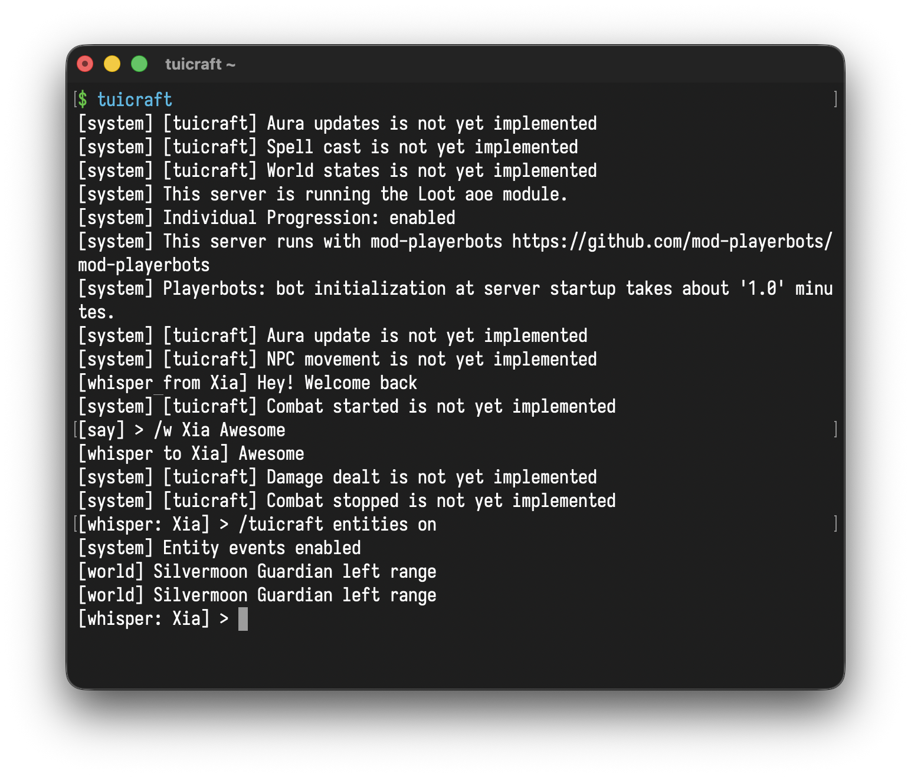

# tuicraft

Chat in WoW 3.3.5a from your terminal. Targets AzerothCore private servers and
is designed to be both human and LLM friendly.

```sh
curl -fsSL tuicraft.vararu.org/install.sh | sh
```



## Features

🔐 **Authentication** - Secure login, realm selection, and character select

💬 **Chat** - Say, yell, whisper, guild, party, raid, and channel messages with
`/r` reply support

👥 **Party Management** - Invite, kick, leave, leader transfer, accept/decline
invitations, live group roster with member stats

👫 **Friends List** - View online/offline friends, add/remove friends, real-time
online status notifications

🚫 **Ignore List** - Server-side ignore list, messages from ignored players
filtered from chat

🔍 **Who Search** - Query online players with filters, human and JSON output

🖥️ **Interactive TUI** - Full terminal UI with slash commands and channel
switching

🤖 **CLI & Daemon** - Background daemon, pipe mode, and JSONL output for
scripting

📝 **Session Logging** - Persistent session log with `tuicraft logs` playback

⚡ **Zero Dependencies** - Pure TypeScript on Bun, compiles to a single binary

## Install

```sh
curl -fsSL tuicraft.vararu.org/install.sh | sh
```

Override the install directory (default: `/usr/local/bin`):

```sh
TUICRAFT_INSTALL_DIR=~/.local/bin curl -fsSL tuicraft.vararu.org/install.sh | sh
```

Pre-built binaries are available on the [releases
page](https://github.com/tvararu/tuicraft/releases).

## Compatibility

| Platform | Architecture         | Status                        |
| -------- | -------------------- | ----------------------------- |
| Linux    | x64, ARM64           | Supported                     |
| macOS    | Apple Silicon, Intel | Supported                     |
| Windows  | WSL2                 | Supported (uses Linux binary) |

## Development

Requires [mise](https://mise.jdx.dev), automatically installs `bun`:

```
mise trust -y
mise bundle
mise build
```

## Testing

```
mise test
```

To run live integration tests against a real server, copy the example config and
fill in your credentials:

```
cp mise.local.toml.example mise.local.toml
# edit mise.local.toml with your account details
mise test:live
```

## Usage

```
tuicraft help              # show help
tuicraft setup
tuicraft                   # interactive TUI
tuicraft send "Hello"      # send a say message (auto-starts daemon)
tuicraft send -w Hemet "x" # whisper
tuicraft send -g "lfm"     # guild chat
tuicraft who               # who query
tuicraft read --wait 5     # read events, wait up to 5s
tuicraft tail              # continuous event stream
tuicraft status            # daemon status
tuicraft stop              # stop daemon
tuicraft skill             # print SKILL.md for AI agents
```

## Roadmap

- [x] 🔐 **0.1 - Auth & Connect:** SRP-6 auth, Arc4-encrypted world session,
      character select, keepalive
- [x] 💬 **0.2 - Chat:** Send/receive whispers, say, guild chat. TUI with
      interactive and pipe modes
- [x] 👥 **0.3 - Party Management:** Invite, kick, leave, leader transfer,
      group roster, member stats
- [x] 🌍 **0.4 - World State:** Parse `SMSG_UPDATE_OBJECT` to track nearby
      entities
- [ ] 🏃 **0.5 - Movement:** Send `CMSG_MOVE_*` opcodes, pathfinding via mmaps
- [ ] 🤖 **0.6 - Automation:** Scriptable command sequences and event
      subscriptions

## Feature coverage

Based on the list of all possible opcodes. Might still be missing some things
that the official game client does.

### 🔐 Authentication

| Feature               | Status |
| --------------------- | ------ |
| SRP-6 login           | ✅     |
| Reconnect proof       | ✅     |
| Realm selection       | ✅     |
| Character select      | ✅     |
| Arc4 encryption       | ✅     |
| Keepalive / time sync | ✅     |
| Warden anticheat      | ❌     |

### 💬 Chat

| Feature                                 | Status |
| --------------------------------------- | ------ |
| Say, yell                               | ✅     |
| Whisper (`/w`, `/r`)                    | ✅     |
| Guild, officer                          | ✅     |
| Party, raid                             | ✅     |
| Channels (`/1`, `/2`, …)                | ✅     |
| MOTD                                    | ✅     |
| Server broadcast messages               | ✅     |
| Chat restricted / wrong faction notices | ✅     |
| Text emotes (`/e`, `/emote`)            | ✅     |
| DND / AFK status                        | ✅     |

### 👥 Social

| Feature                              | Status |
| ------------------------------------ | ------ |
| Who search                           | ✅     |
| Party invite / kick / leave / leader | ✅     |
| Group roster + member stats          | ✅     |
| Friends list                         | ✅     |
| Ignore list                          | ✅     |
| Channel join / leave                 | ✅     |
| Duel accept / decline                | ✅     |

### 🏰 Guild

| Feature                               | Status |
| ------------------------------------- | ------ |
| Guild chat                            | ✅     |
| Guild roster                          | ✅     |
| Guild events                          | ✅     |
| Guild invite / kick / leave / promote | ✅     |
| Guild bank                            | ❌     |

### ✉️ Mail

| Feature             | Status |
| ------------------- | ------ |
| Send / receive mail | ❌     |
| Mail notifications  | ✅     |

### 🏪 Economy

| Feature       | Status |
| ------------- | ------ |
| Auction house | ❌     |
| Vendors       | ❌     |
| Trade         | ❌     |

### 🌍 World

| Feature           | Status |
| ----------------- | ------ |
| Object updates    | ✅     |
| Movement          | ❌     |
| Spells / auras    | ❌     |
| Combat log        | ❌     |
| Loot              | ❌     |
| Items / inventory | ❌     |

### 📜 PvE

| Feature              | Status |
| -------------------- | ------ |
| Quests               | ❌     |
| NPC gossip           | ❌     |
| Trainers             | ❌     |
| Taxi                 | ❌     |
| Instances / dungeons | ❌     |

### ⚔️ PvP

| Feature               | Status |
| --------------------- | ------ |
| Battlegrounds         | ❌     |
| Arena                 | ❌     |
| Random roll (`/roll`) | ✅     |

### 📊 Progression

| Feature              | Status |
| -------------------- | ------ |
| Achievements         | ❌     |
| Talents              | ❌     |
| LFG / dungeon finder | ❌     |
| Calendar             | ❌     |

## Prior art

- [swiftmatt/wow-chat-client](https://github.com/swiftmatt/wow-chat-client) -
  Node.js WoW 3.3.5a chat client, primary reference for packet formats and
  SRP-6 auth flow
- [azerothcore/azerothcore-wotlk](https://github.com/azerothcore/azerothcore-wotlk) -
  open-source WoW 3.3.5a server emulator, used as the canonical reference for
  handler implementations and update field definitions
- [mod-playerbots/mod-playerbots](https://github.com/mod-playerbots/mod-playerbots) -
  AzerothCore playerbot module, the target server environment for tuicraft
- [wowserhq/wowser](https://github.com/wowserhq/wowser) - browser-based WoW
  3.3.5a client in JS/React/WebGL, useful for cross-referencing opcodes, auth
  error codes, and realm parsing
- [gtker/wow_messages](https://github.com/gtker/wow_messages) - auto-generated
  WoW protocol definitions in `.wowm` format, machine-readable spec for every
  opcode across Vanilla/TBC/WotLK
- [namreeb/namigator](https://github.com/namreeb/namigator) - C++ pathfinding
  and line-of-sight library for WoW, reads MPQ files and generates navmesh via
  Recast/Detour
- [gtker/namigator-rs](https://github.com/gtker/namigator-rs) - Rust FFI
  bindings for namigator, API reference for the pathfinding integration

## License

[AGPLv3](LICENSE).
