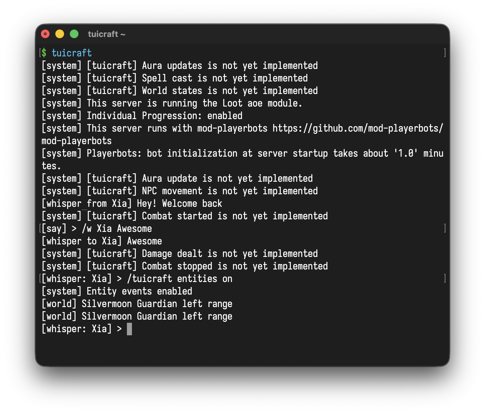

# tuicraft

Chat in WoW 3.3.5a from your terminal. Targets AzerothCore private servers and
is designed to be both human and LLM friendly.

```sh
curl -fsSL tuicraft.vararu.org/install.sh | sh
```



## Features

🔐 **Authentication** - Secure login, realm selection, and character select

💬 **Chat** - Say, yell, whisper, guild, party, raid, and channel messages with
`/r` reply support

👥 **Party Management** - Invite, kick, leave, leader transfer, accept/decline
invitations, live group roster with member stats

👫 **Friends List** - View online/offline friends, add/remove friends, real-time
online status notifications

🚫 **Ignore List** - Server-side ignore list, messages from ignored players
filtered from chat

🔍 **Who Search** - Query online players with filters, human and JSON output

🖥️ **Interactive TUI** - Full terminal UI with slash commands and channel
switching

🤖 **CLI & Daemon** - Background daemon, pipe mode, finite JSON envelopes, and
JSONL envelopes from `tail --json` for scripting

**Direct control and spatial observation** - Bounded walk, face, target, and
halt through the CLI. `control` separates the current pose (server-observed
or predicted) from the last server observation, and requested selection from
the observed target. Relogin confirms ordinary movement.
`nearby` reports 3D/XY distance and facing from the current pose, and
`nearby --json` adds each other player's received movement (`remotePose`):
exact flags, mover time and age, never extrapolated.
Ground refusals give conservative next steps, not automatic detours.
Combat, routing, and cycle commands also exist.

📝 **Session Logging** - Persistent session log with `tuicraft logs` playback

⚡ **Zero Dependencies** - Pure TypeScript on Bun, compiles to a single binary

## Install

```sh
curl -fsSL tuicraft.vararu.org/install.sh | sh
```

Override the install directory (default: `/usr/local/bin`):

```sh
TUICRAFT_INSTALL_DIR=~/.local/bin curl -fsSL tuicraft.vararu.org/install.sh | sh
```

Pre-built binaries are available on the [releases
page](https://github.com/tvararu/tuicraft/releases).

## Compatibility

| Platform | Architecture         | Status                        |
| -------- | -------------------- | ----------------------------- |
| Linux    | x64, ARM64           | Supported                     |
| macOS    | Apple Silicon, Intel | Supported                     |
| Windows  | WSL2                 | Supported (uses Linux binary) |

## Development

Requires [mise](https://mise.jdx.dev), which installs `bun`:

```
mise trust -y
mise bundle
mise build
```

Agents own engineering, review, and integration. Verified changes land on
`main`; pull requests, force-pushes, hook bypass, and releases are not used.
Frameworks such as Superpowers are optional. Keep typecheck, format, and
meaningful tests; coverage is diagnostic, not a percentage gate. Repository
rules are in [AGENTS.md](AGENTS.md).

## Testing

```
mise test
```

To run live integration tests against a real server, `mise test:live` needs
two game accounts in `WOW_ACCOUNT_1`, `WOW_PASSWORD_1`, `WOW_CHARACTER_1`,
`WOW_ACCOUNT_2`, `WOW_PASSWORD_2` and `WOW_CHARACTER_2` (`WOW_HOST`,
`WOW_PORT` and `WOW_LANGUAGE` are optional). Use throwaway accounts made with
`bun src/factory/main.ts soap create fresh --gm 2` and
`bun src/factory/main.ts soap create eversong10`, and delete them with
`soap delete <ACCOUNT>` afterwards; see [AGENTS.md](AGENTS.md#testing) and
[the manual](docs/manual.md#testing). To keep the variables in a file, copy
the example config:

```
cp mise.local.toml.example mise.local.toml
# edit mise.local.toml with your account details
mise test:live
```

## Usage

```
tuicraft help              # show help
tuicraft setup             # interactive wizard
tuicraft setup --account A --password P --character C # also --host --port --language --timeout_minutes
tuicraft                   # interactive TUI
tuicraft send "Hello"      # send a say message (auto-starts daemon); -s is explicit say
tuicraft send -w Hemet "x" # whisper
tuicraft send -y "hi"      # yell
tuicraft send -g "lfm"     # guild chat
tuicraft -p "inc"          # party chat; -w/-y/-g/-p also work without send
tuicraft send "/roll 50"   # slash command via the daemon
tuicraft who               # who query
tuicraft group [--json]    # party leader, loot rule and members' health
tuicraft read --wait 5     # read unread events (XP, loot, cast failures), wait up to 5s
tuicraft send "/roll" --wait 5 # events after the roll; older unread stay
tuicraft tail              # continuous event stream
tuicraft control [--json]  # current vs server pose, requested vs observed target, refusal
tuicraft nearby [--all] [--json] # nearest first: 3D/XY yards, facing, origin; JSON remotePose for players
tuicraft move forward 1000 [--json] # walk 1-10000ms (default 1000); left/right strafe
tuicraft face 1.57         # facing in radians
tuicraft face-guid 0xabc   # face a currently observed entity on this map
tuicraft walk-toward 3 0xabc # direct bounded leg toward one sampled GUID
tuicraft walk-toward 2 <grounded-x> <grounded-y> <grounded-z> # direct leg toward known ground
tuicraft target 0xabc      # request selection (0 clears); uint64 hex or decimal
tuicraft combat [--json]   # vitals, target, auras, cooldowns, last XP
tuicraft spells [--json]   # learned spellbook
tuicraft cast 585 0xabc    # cast learned spell at guid (0 = self); outcome in combat --json .lastOutcome, e.g. reason out_of_range
tuicraft attack 0xabc      # auto-attack
tuicraft cancel-cast        # interrupt the current cast
tuicraft stop-attack       # stop auto-attack
tuicraft fight 0xabc [--json] # Jev tactics; optional --framing none|minimal|mechanics
tuicraft fight 0xabc conserve mana # extra words are the instruction
tuicraft tactics [--json]  # outcome, target, vitals and last XP of the last run
tuicraft cycle 0xa 0xb --max 3 --instruction stay alive # explicit GUID queue from nearby; no auto-acquire
tuicraft cycle --resume --instruction "kite" # resume the remaining queue after halt
tuicraft cycle --quest 8325    # pick quest targets itself until the log slot completes
tuicraft cycling               # readable phase, kill credit, loot and stop reason
tuicraft goto 1 2 [3]      # ground route; Z from the unique ground column when omitted; redirects an active route
tuicraft goto 0xabc        # once to an observed creature; target_lost if it disappears, unreachable is never retried
tuicraft navigation --json # route state, refusal and conservative next step
tuicraft recovery        # observed life and corpse-reclaim conditions
tuicraft query-corpse      # request corpse information
tuicraft release-spirit    # request release while observed dead
tuicraft reclaim-corpse    # request guarded reclaim near the actual corpse
tuicraft spirit-healer 0xabc  # request resurrection from an observed healer-flagged creature
tuicraft resurrect accept # answer a current offer (recovery shows it); decline is also supported
tuicraft quests --json     # offered dialog, observed log and unanswered intent
tuicraft talk 0xabc        # request conversation with an observed giver
tuicraft query-quest 42    # request metadata, not permission to accept
tuicraft select-option 0   # choose an offered gossip option; optional quoted code
tuicraft select-quest 42   # choose only a currently offered quest
tuicraft accept-quest      # request acceptance of current offered details
tuicraft complete-quest 42 # request completion of an offered quest
tuicraft request-reward    # request the current reward offer
tuicraft choose-reward 0   # choose an offered reward (zero-based 0-5)
tuicraft abandon-quest 0   # request abandonment of a log slot (zero-based 0-24)
tuicraft cancel-interaction # request dialog close; wait for observed closure
tuicraft inventory       # carried item stacks, free slots and coinage
tuicraft experience      # observed level, XP and XP/level-up notices
tuicraft loot            # current offer and unanswered requests
tuicraft open-loot 0xabc   # request loot from an observed lootable corpse
tuicraft take-loot 0 [--json] # request a slot actually present in that offer
tuicraft take-money        # request offered money
tuicraft release-loot      # request closure of a window you leave partly looted
tuicraft use 255 29 [--json] # eat, drink or drink a potion from an inventory bag/slot
tuicraft halt              # stop motion, cast, attack, tactics, navigation, cycle
tuicraft start [--json]    # start background daemon and connect
tuicraft status [--json]   # daemon socket status, not world-session health
tuicraft stop [--json]     # stop daemon
tuicraft logs              # print the raw session log
tuicraft record --since 1790382736199 # session record JSON from the log
tuicraft skill             # print SKILL.md for AI agents
tuicraft version           # print version
```

The GUIDs in these examples are placeholders. Copy current creature GUIDs from
`nearby --json` before `fight` or `cycle`; `target` also accepts a stale GUID
and `control --json` separates the sent request from the observed selection.

The interactive TUI's slash commands (`/w`, `/invite`, `/ginvite`, `/roll` and
more, with long forms such as `/whisper`) are listed in
[Interactive Commands](docs/manual.md#interactive-commands); most also work as
`tuicraft send "/..."`. Scripts can also write one-line verbs such as
`WHO_JSON mage` straight to the daemon socket; see
[Socket Protocol](docs/manual.md#socket-protocol).

## JSON CLI output

Add `--json` to any daemon-backed command. This includes `send`, chat flags,
`who`, `read`, `nearby`, gameplay inspections and actions, and `start`, `status`,
`stop`. Examples: `tuicraft fight 0xabc --json`,
`tuicraft take-loot 0 --json`, and `tuicraft status --json`.

Every finite `--json` invocation prints exactly one JSON object and a newline
to stdout, including empty results, `send --wait` results, and errors. Parse
the complete stdout as one document. Each envelope has exactly five fields:
`command` (public command name or `null`), `kind` (`intent`, `result`,
`events`, or `error`), `data` (query JSON value or `null`), `events` (array of
event objects), and `error` (object with `stage` and `message`, or `null`).
Chat aliases use `command: "send"`. Inspect query fields inside `data`.

```json
{"command":"fight","kind":"intent","data":null,"events":[],"error":null}
```

An empty `nearby --json` returns `data: []`; an empty `read --json` returns
`events: []`. Both print one envelope. `send --wait N --json` returns one
envelope with waited events in `events`, not an acknowledgment plus event lines.
`kind: "intent"` confirms that the daemon acknowledged the request. It does
not prove the game server accepted or completed it. Inspect later state and
events for outcomes; predicted and unknown facts do not become observed facts.

Creature chat uses its own event types: `MONSTER_SAY`, `MONSTER_YELL`,
`MONSTER_WHISPER`, `MONSTER_PARTY`, `MONSTER_EMOTE`, `RAID_BOSS_EMOTE` and
`RAID_BOSS_WHISPER`. Emotes read as sentences, for example
`[monster emote] Darkwraith goes into a frenzy!`.

Only `tail --json` is continuous JSONL. Parse each line as an envelope. It
emits one envelope per event and no line for an empty poll:

```json
{"command":"tail","kind":"events","data":null,"events":[{"type":"SAY","sender":"Xi","message":"hello"}],"error":null}
```

JSON errors print one envelope on stdout and exit with status 1. `error.stage`
is `arguments`, `startup`, `command`, or `wait`. A failure after a
`send --wait` acknowledgment preserves its `kind` and `data` and sets
`error.stage: "wait"`. `status --json` reports whether the daemon socket
responds, not whether the world session is healthy. `start --json` reports
whether a daemon started or already existed. `stop --json` reports intent when
it stops a daemon and a `not_running` result when none exists.
`logs` keeps its raw JSONL session log; `skill` keeps its raw reference text.
`record [--since MS]` prints one JSON session record derived from the logged
CYCLE, TACTICS and RECOVERY events: cycle runs and resumes, kills, skips and
blocking stops, deaths and recoveries, interventions (HALT, override, resume,
instruction change), discarded Jev results, and latency. Its loop rate
(requests per active second) and decision rate (requests offering more than
`wait`/`cancel`, per active second) must be quoted together. It always prints JSON.
Neither accepts `--json`; neither do `setup`, `help`, `version`, the TUI, or
internal daemon mode.

Without `--json`, `combat`, `tactics`, `cycling`, `recovery`, `inventory`,
`experience`, and `loot` print readable summaries. Control actions report daemon
request acceptance, not server success; `fight` replies when the run ends with
its outcome (`completed: server_kill_credit, XP 60`), and `cycle` says it ended.
Use `--json` for the full observed state and for scripts.

## Gameplay notes

Spellbook/tactics require compatible client tables; ground routes require
Namigator data and its native library. Set their optional config paths and the
daemon's `TYPESAFE_API_KEY` as described in
[gameplay configuration](docs/manual.md#gameplay-configuration), which also
covers `JEV_ENDPOINT_URL`/`TYPESAFE_ENDPOINT_URL`, the test-only `JEV_FAULT`,
and `WOW_JEV_FRAMING` (the default `fight --framing`).

The narrow Jev spell kit requires observed normal form, including protocol-defined
zero fields in a complete server CREATE. Unknown or nonzero forms disable spells,
not necessarily melee. `fight` engages hostile and neutral creatures. It
refuses friendly ones (`target_friendly`), players (`target_not_pve_creature`)
and an unknown faction relation (`unverified_hostile_relation`), except that a
creature attacking the character is always fair game. `tactics --json` reports
the relation as `lastOutcome.observation.targetRelation`. A structural lack of
supported combat actions stops with a reason; cooldown and server-response waits
do not. A fight in which the target takes no damage and the separation does not
close by at least 1 yd for 30 s blocks with `no_progress` (a `cycle` skips the
target). Inspect `tactics` for terminal observations. Jev may choose directional
movement under a renewable lease (`wait` holds, `stop_moving` releases). A slow
Jev reply (over 5 s) is discarded and retried; 3 in a row stop the fight with
`jev_timeout`, keeping auto-attack on a live attacker (`tactics.defense`).

`cycle` takes an explicit GUID queue selected from `nearby --json`; it does
not auto-acquire. It runs `fight` over the queue and requests loot after each
completed target. A target that dies, is unreachable, or fails to fight is
skipped with a recorded cause instead of stopping the loop. A mid-fight death
releases the spirit, walks the ghost in bounded legs to about 30 yd from the
corpse, reclaims it (or accepts a current resurrection offer), records
`lastRecovery`, and continues with the next queued target; the target it died
to is `skipped` with cause `died`. A recovery that cannot finish stops with
its cause, such as `corpse_out_of_range`. `--max` caps tactics-loop starts for
the whole run (positive integer, default 10). Inspect `cycling --json` for
each target's status and an open-ended `stopCause` with `stopDetail`. The loop waits for the server release acknowledgement after close; `loot_denied:timeout` and `loot_release_unconfirmed` stop without recording a gain.
`halt` keeps the queue: `cycle --resume` continues from the first target
still `queued` (a halted fight is fought again, a `done` target is not), with
an optional new `--instruction` and a fresh `--max` budget. It emits a
`resumed` CYCLE event and fails with `cycle_active` or
`cycle_nothing_to_resume`; while dead or a ghost it recovers first even when
no target is left.
A kill whose corpse has no loot is recorded as `loot: "none"` on its queue
entry and the loop continues; `target_death_unconfirmed` stops it when the server
never shows the corpse dead.
`lastLoot.slotsTaken` and `moneyTaken` report requests and offered money, not
verified item gains. Confirm storage from `inventory --json` slot/count changes.

Repeated `move` in the same direction renews active manual movement without a
stop; taking control from Jev or cycle still stops the old owner.
`walk-toward` travels at most 20 yards in one direct leg and returns terminal
JSON with `status`, predicted `traveled` distance, `pose`, and a `reason` if
stopped. It exits with status 1 on a stop; `--json` then keeps that outcome in
`data` beside the error:

```json
{"command":"walk-toward","data":{"status":"stopped","reason":"target_stale","traveled":0,"pose":{"mapId":530,"x":8715.2,"y":-6653.1,"z":72.8,"orientation":5.08,"source":"predicted","updatedAt":1790382964703}},"error":{"message":"walk stopped without completion","stage":"command"},"events":[],"kind":"result"}
```

An observed GUID is sampled once, not tracked.
Coordinates require unambiguous native ground.
Ground refusal, correction, HALT, or takeover stops the leg rather than
steering blindly. A `completed` result is not server-confirmed arrival.

Use the existing commands for an agent-guided corpse run:
1. Inspect `recovery --json`. Trust observed life, not positive ghost health or an `OK` response.
2. If dead, request `release-spirit` once. Wait for observed ghost state. Skip release if already ghost.
3. Check for an unanswered or stale corpse query before `query-corpse`. Reuse a found corpse from the current death epoch. Do not query again. Stop on an absent reply. Otherwise query once and await a found corpse. Compare the displayed corpse map, actual corpse map, and pose map. Travel with short `face` and `move` legs, not `goto` from a ghost. Stop if ground movement makes no progress.
4. Reclaim only within 39 yards in 3D when `reclaim.canRequest=true`. A known future delay blocks reclaim. Unknown delay permits one explicit request but does not prove readiness. Reclaim may restore life beside the killer at partial health. Plan an escape heading before reclaim near a killer. If no safe heading is known, report the risk. After `OK`, flee immediately, then inspect for observed life. Do not retry an unanswered request.

`spirit-healer <guid>` requests resurrection from one observed creature whose NPC flags carry the healer bit (0x4000). It requires observed ghost state. It rejects a duplicate while the previous request is unanswered, for 10 s or until `halt`. After 10 s a new request replaces the unanswered one; `halt` clears it at once. Either way `recovery --json` records `spiritHealerCleared` (`guid`, `requestedAt`, `clearedAt`, `reason` `timeout` or `halt`) and a `spirit_healer_cleared` RECOVERY event. The server silently ignores a request from out of interaction range, so move within a few yards before retrying. It never auto-activates and never reports success on intent. Server spirit resurrection may incur durability loss. Gossip option 0 (`select-option 0` after `talk`) is answered by a server confirmation, recorded in `recovery --json` as `spiritHealerConfirm` (`guid`, `receivedAt`) and a `spirit_healer_confirm_observed` RECOVERY event. tuicraft does not answer it for you: send `spirit-healer <guid>` from within a few yards to revive. After `OK`, inspect `recovery --json` for observed `life=alive`.
`resurrect accept|decline` answers only a current offer. After reconnect, run `spells` once if `combat --json` lists every learned spell as `unknownLearned`. Then inspect combat again.

Quest actions use the current server-offered dialog and giver. Inspect `quests`
between actions instead of assuming that a sent request changed the quest log.
Use `select-option <id> [code]` for offered gossip, or `select-quest <id>` for an
offered quest. Quote a code as one shell argument. Empty code differs from no code.
Auto-accept quests enter the log on `select-quest`; `accept-quest` then fails
with `quest_already_in_log`.
The IPC representation uses JSON to preserve spaces without command injection.
`complete-quest`, `request-reward`, and `choose-reward` require the corresponding
offered dialog. Reward indices and abandonment slots are zero-based.
Collect objectives are not in the log counters: after `query-quest`, `quests`
reports `items` (required vs carried) and correlates each item push with the
observed bags as a `collect` progress event.
`OK` is intent only. Acceptance/progress/removal require observed log changes,
and rewards require a server reward notification. Unanswered metadata is unknown,
not missing. `cancel-interaction` requests closure and does not immediately unlock
another mutation. The cancelled request stays reported as `unresolved` until an
authoritative outcome. Do not retry before an observed close or authoritative outcome.

`experience` reads the observed level, XP and next-level XP fields beside the
last XP-gain and level-up notices. A notice is not an XP change; compare the
fields before and after a kill or turn-in.

`inventory` exposes observed carried items, bag capacity and coinage. Unknown
counts and capacity remain unknown. `loot` separates the current offer, pending
intent, errors, item/money notices and actual inventory evidence.
Opening requires an observed lootable creature corpse and authoritative alive
self state. Take only offered slots. `OK`, slot removal and money clearance do
not prove stored items or a coinage gain. Inspect raw inventory changes separately.
Like the real client, tuicraft releases the window itself once a take leaves it
with no items and no money; `release-loot` is only needed after a partial loot,
and on a window that is already closing or closed it sends nothing.

A release-only notification during opening can precede a later full response.
If none follows within 3 seconds, or the corpse despawns first, the open fails:
`loot` goes back to `closed`, says why in `Last open failed:` (`lastOpenFailure`
in `--json`), and the next corpse can be opened without a reconnect.

## Roadmap

See [docs/roadmap.md](docs/roadmap.md) for current direction. That document is
ambition, not a claim that those capabilities already exist.

## Feature coverage

Based on the list of all possible opcodes. Might still be missing some things
that the official game client does.

### 🔐 Authentication

| Feature               | Status |
| --------------------- | ------ |
| SRP-6 login           | ✅     |
| Reconnect proof       | ✅     |
| Realm selection       | ✅     |
| Character select      | ✅     |
| Arc4 encryption       | ✅     |
| Keepalive / time sync | ✅     |
| Warden anticheat      | ❌     |

### 💬 Chat

| Feature                                 | Status |
| --------------------------------------- | ------ |
| Say, yell                               | ✅     |
| Whisper (`/w`, `/r`)                    | ✅     |
| Guild, officer                          | ✅     |
| Party, raid                             | ✅     |
| Channels (`/1`, `/2`, …)                | ✅     |
| MOTD                                    | ✅     |
| Server broadcast messages               | ✅     |
| Chat restricted / wrong faction notices | ✅     |
| Text emotes (`/e`, `/emote`)            | ✅     |
| DND / AFK status                        | ✅     |

### 👥 Social

| Feature                              | Status |
| ------------------------------------ | ------ |
| Who search                           | ✅     |
| Party invite / kick / leave / leader | ✅     |
| Group roster + member stats          | ✅     |
| Friends list                         | ✅     |
| Ignore list                          | ✅     |
| Channel join / leave                 | ✅     |
| Duel accept / decline                | ✅     |

### 🏰 Guild

| Feature                               | Status |
| ------------------------------------- | ------ |
| Guild chat                            | ✅     |
| Guild roster                          | ✅     |
| Guild events                          | ✅     |
| Guild invite / kick / leave / promote | ✅     |
| Guild bank                            | ❌     |

### ✉️ Mail

| Feature             | Status |
| ------------------- | ------ |
| Send / receive mail | ❌     |
| Mail notifications  | ✅     |

### 🏪 Economy

| Feature       | Status |
| ------------- | ------ |
| Auction house | ❌     |
| Vendors       | ❌     |
| Trade         | ❌     |

### 🌍 World

| Feature           | Status |
| ----------------- | ------ |
| Bounded walk / face / target | ✅     |
| Pathfinding / navigation     | Ground routes on map 530 |
| Spells / auras    | Learned-spell casts, observed auras |
| Combat log        | ❌     |
| Loot              | Bounded creature offers |
| Items / inventory | Observed carried state |

### 📜 PvE

| Feature              | Status |
| -------------------- | ------ |
| Quests               | Offered dialogs and observed log |
| NPC gossip           | Offered options |
| Trainers             | ❌     |
| Taxi                 | ❌     |
| Instances / dungeons | ❌     |

### ⚔️ PvP

| Feature               | Status |
| --------------------- | ------ |
| Battlegrounds         | ❌     |
| Arena                 | ❌     |
| Random roll (`/roll`) | ✅     |

### 📊 Progression

| Feature              | Status |
| -------------------- | ------ |
| Achievements         | ❌     |
| Talents              | ❌     |
| LFG / dungeon finder | ❌     |
| Calendar             | ❌     |

## Prior art

- [swiftmatt/wow-chat-client](https://github.com/swiftmatt/wow-chat-client) -
  Node.js WoW 3.3.5a chat client, primary reference for packet formats and
  SRP-6 auth flow
- [azerothcore/azerothcore-wotlk](https://github.com/azerothcore/azerothcore-wotlk) -
  open-source WoW 3.3.5a server emulator, used as the canonical reference for
  handler implementations and update field definitions
- [mod-playerbots/mod-playerbots](https://github.com/mod-playerbots/mod-playerbots) -
  AzerothCore playerbot module, the target server environment for tuicraft
- [wowserhq/wowser](https://github.com/wowserhq/wowser) - browser-based WoW
  3.3.5a client in JS/React/WebGL, useful for cross-referencing opcodes, auth
  error codes, and realm parsing
- [gtker/wow_messages](https://github.com/gtker/wow_messages) - auto-generated
  WoW protocol definitions in `.wowm` format, machine-readable spec for every
  opcode across Vanilla/TBC/WotLK
- [namreeb/namigator](https://github.com/namreeb/namigator) - C++ pathfinding
  and line-of-sight library for WoW, reads MPQ files and generates navmesh via
  Recast/Detour
- [gtker/namigator-rs](https://github.com/gtker/namigator-rs) - Rust FFI
  bindings for namigator, API reference for the pathfinding integration

## License

[AGPLv3](LICENSE).
