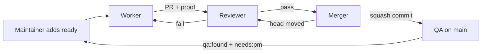

# Dev factory

How the factory works now. History and rationale live in
[plans/2026-09-25-dev-factory-design.md](plans/2026-09-25-dev-factory-design.md).

## Flow



Roles are Orca automations running `omp` through `src/factory/omp-factory`,
each in a fresh `auto-*` worktree, from the runner clone
`~/.local/share/tuicraft-factory/runner` (follows `origin/main`). Prompts
are in `src/factory/prompts/`. The wrapper also passes
`--config src/factory/omp-factory.yml`, so factory roles run with omp memory
and autolearn off. Every role starts with
`bun src/factory/main.ts precheck <role>` and stops on exit 1.

## Labels

| Label | Meaning |
|---|---|
| `ready` | The maintainer wants it worked on. Only counts if the maintainer added it last |
| `agent:working` | A worker owns it |
| `agent:review` | PR waits for review |
| `agent:reviewing` | A reviewer owns it |
| `agent:rework` | Reviewer or merger wants changes |
| `agent:merging` | Reviewed, waits for the merger |
| `agent:landing` | The merger is landing it (one issue at a time) |
| `needs:pm` | The maintainer must decide. `ready` from the maintainer overrides it |
| `qa:found` | Filed by QA |

An issue with an open blocked-by issue is never picked up or landed.

## Roles

- **Worker.** Takes the highest-priority in-scope issue, keeps one workpad
  comment, live-tests on its own SOAP account, and opens a PR from
  `factory/<N>-<slug>`. The PR title is the future commit subject
  (Conventional, ≤ 50 chars); the body opens with a why paragraph, then
  `Fixes #N` and `## Proof`. Commits inside the PR don't matter. At most 3
  attempts per issue, then `needs:pm`.
- **Reviewer.** Runs `mise ci` on the head and posts `factory/ci`, judges
  the outcome and code, and posts `factory/review`. Never runs
  `mise test:live`: it judges the implementer's proof. If an earlier head
  passed review and the new head's zero-context patch matches it
  (`same-patch`), the review carries over after CI. Claims are per head SHA.
- **Merger.** The precheck first bounces any `agent:merging` issue whose
  current head lacks green `factory/ci` and `factory/review` back to
  `agent:review` (third moved head: `needs:pm`). It then lands one PR at a
  time: rebase onto `main`, `same-patch` against the reviewed head (differs:
  back to review), `mise ci`, push, then
  `gh pr merge --squash --match-head-commit`.
- **QA.** Runs when `main` moves. Maps new commits to PRs and issues via
  trailers, smoke-tests and plays, and files problems as `qa:found` +
  `needs:pm`.
- **Reaper** (systemd timer, 5 min). Removes finished or over-cap `auto-*`
  worktrees that are clean and pushed or landed, and other worktrees that
  are landed, clean and idle over 12 h. Dirty trees are archived to
  `tmp/worktree-archive-<date>/` and reported in a `Reaper: … held` issue.

## Landing

`main` is squash-only with linear history. Required statuses: `signoff/ci`
(pre-push hook), `factory/ci`, `factory/review`. Each PR becomes one
commit, authored by OpenHubris:

```
<PR title>

<PR why paragraph, wrapped at 72>

Refs: #<each closed issue>
PR: #<pr>
Co-authored-by: Theodor Vararu <theo@vararu.org>
```

`bun src/factory/main.ts squash-message <pr>` builds it and fails on a bad
title, missing why, or no closed issue. Revert with one `git revert <sha>`.

## Stacked PRs

When an issue needs another open PR's code: the child issue is blocked by
the parent's issue, the child PR's base is the parent's branch, and its body
has `Stacked-on: #<parent PR> <parent tip>`. After the parent lands, GitHub
retargets the child to `main` and the merger runs
`git rebase --onto origin/main <parent tip>`. At most 2-3 deep.

## Pace

`mise factory:pace [default|max]` sets schedules and caps.

| | default | max |
|---|---|---|
| Worker | every 3 min, 3 in flight | every 2 min, 6 |
| Reviewer | every 3 min, 3 in flight | every min, 6 |
| Merger | every 10 min | every 3 min |
| QA | every 30 min | every 15 min |

Run caps: worker 3 h, QA 2 h, reviewer and merger 1 h.
