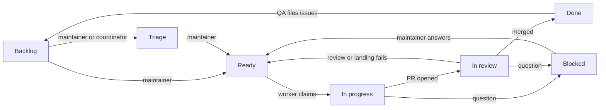

# Dev factory

How the factory works now. History and rationale live in
[plans/2026-09-25-dev-factory-design.md](plans/2026-09-25-dev-factory-design.md).

## Flow

Work state lives in the Status field of the project board
[tvararu/1](https://github.com/users/tvararu/projects/1). Design:
[plans/2026-09-26-project-board-design.md](plans/2026-09-26-project-board-design.md).



Roles are Orca automations running `omp` through `src/factory/omp-factory`,
each in a fresh `auto-*` worktree, from the runner clone
`~/.local/share/tuicraft-factory/runner` (follows `origin/main`). Orca's
`agentCmdOverrides.omp` is `~/.local/bin/omp-factory`, a symlink to the
runner's wrapper that `bun src/factory/main.ts setup wrapper --apply`
installs, so the wrapper and its `omp-factory.yml` follow `main`. The wrapper
passes that file as `--config` to factory roles, so they run with omp memory
and autolearn off. Prompts are in `src/factory/prompts/`. Every role starts
with `bun src/factory/main.ts precheck <role>` and stops on exit 1.

Orca keeps its own copy of each role's prompt. Every reaper pass, run from
the freshly reset runner clone, edits the prompt of any role automation whose
copy differs from `main` and changes nothing else, so a disabled automation,
the pace schedule and `setupDecision` stay as they are, and a prompt change
is live within one reaper tick of landing. `bun src/factory/main.ts setup
automations --apply` is still how automations are created or their other
fields changed.

`omp-factory` also keeps agents away from the maintainer's character. Every
omp it starts for a factory role, or in any tuicraft worktree other than the
main checkout (which covers the coordinator's `orca-ide worktree create
--agent omp` launches), gets per-run `XDG_CONFIG_HOME`, `XDG_RUNTIME_DIR`
and `XDG_STATE_HOME`. Config and state live under `factory-xdg/` in the
worktree's git directory (`git rev-parse --absolute-git-dir`), which git
status never shows and worktree removal deletes. The runtime directory is
`$XDG_RUNTIME_DIR/tuicraft-factory-<hash>`, keyed by the first 12 hex
digits of the git directory's SHA-256, because sockets such as
`systemd/private` must fit in 108 bytes and a git directory path grows
with the worktree name. It holds a `.factory-gitdir` link to its git
directory, and each launch deletes the `tuicraft-factory-*` directories
whose git directory is gone. A launch from an already isolated shell
reuses the same directories. Each links every entry of the real directory
except `tuicraft` and the other `tuicraft-factory-*` directories, so `gh`,
git, `mise` and `systemctl --user` find their usual config, state and
sockets, while plain `bun src/main.ts` finds no config and cannot reach the
default daemon socket. The main checkout and other repositories keep the
default directories. Live characters come from
`bun src/factory/main.ts soap create <preset>`, which also writes
`tmp/tc-<ACCOUNT>`: it exports the account's own `XDG_*` directories under
`tmp/factory-account-<ACCOUNT>/`, refuses to run when that account's config
or running daemon names another character, prints the character on
stderr, and runs `bun src/main.ts "$@"`. `soap delete <ACCOUNT>` removes
the wrapper and those directories.

## Status

| Status | Moved there by | Meaning |
|---|---|---|
| Backlog | GitHub's auto-add, for every new issue | Filed, not started |
| Triage | the maintainer or the coordinator | Picked to look at now; the factory ignores it like Backlog and never moves a card there, and only the maintainer moves one on to Ready |
| Blocked | any agent, with a comment | Waits on the maintainer; the comment says what the problem is and what to do |
| Ready | the maintainer; agents only when an open factory PR exists | Work on this (rework if a PR is open); oldest first |
| In progress | worker, on claim | A worker owns it |
| In review | worker, on opening the PR | Reviewer, then merger |
| Done | GitHub, on merge or close | Landed or closed |

Moving a card to Ready is the whole release step. No agent moves a card to
Ready unless it already has an open factory PR, no agent @-mentions anyone,
and the Blocked group is the maintainer's inbox. An issue with an open
blocked-by issue stays where it is and is never picked up or landed.

`bun src/factory/main.ts status <issue>` prints a card's Status;
`status <issue> <backlog|triage|blocked|ready|in-progress|in-review|done>` sets it
(adding the issue to the board if missing) and refuses `ready` without an
open `factory/<N>-…` PR.

Comments on the issue are the per-run locks:

- `<!-- factory:claim <run> -->`: a worker's claim. Live for 3 h and only
  if newer than the card's last Status change.
- `<!-- factory:claim <run> <sha> -->`: a reviewer's claim on one head. Live
  for 1 h.
- `<!-- factory:landing <run> -->`: the merger's landing claim. Live for
  1 h; `bun src/factory/main.ts landings` lists the live ones, oldest first,
  and the oldest wins. A reviewer does not pick up a card while it is live.

Two more mark heads for the bounce count:

- `<!-- factory:bounce <sha> -->`: the merger precheck bounced this head.
- `<!-- factory:rebase <sha> -->`: the merger rebased the PR to this head
  and the patch changed, so it needs a fresh review but is not a bounce.

GitHub hides these markers, and a comment that is only a marker renders
as an empty "No description provided." So every factory comment puts
visible text after its marker: the claims and the landing claim one
sentence on the same line saying who is doing what, for example
`<!-- factory:claim <run> --> Factory worker <run> claimed this issue.`
The parsers match only the start of the body, so the text never changes
what a marker means.

## Roles

- **Worker.** Takes the oldest Ready card with no live claim, moves it to In
  progress, keeps one workpad comment, live-tests on its own SOAP account,
  opens a PR from `factory/<N>-<slug>` and moves the card to In review. A
  Ready card with an open factory PR is rework. The PR title is the future
  commit subject (Conventional, ≤ 50 chars); the body opens with a why
  paragraph, then `Fixes #N` and `## Proof`. Commits inside the PR don't
  matter. At most 3 attempts per issue, then Blocked.
- **Reviewer.** Takes In review cards whose PR head lacks `factory/review`.
  Runs `mise ci` on the head and posts `factory/ci`, judges the outcome and
  code, and posts `factory/review`. Pass leaves the card In review for the
  merger; fail moves it back to Ready; a product question moves it to
  Blocked. Never runs `mise test:live`: it judges the implementer's proof.
  If an earlier head passed review and the new head's zero-context patch
  matches it (`same-patch`), the review carries over after CI. Claims are
  per head SHA.
- **Merger.** The precheck first bounces In review cards whose head moved
  after a passing review: it comments "head changed since review" and the
  card stays In review, so the reviewer checks the new head. The third
  moved head since the card's last move to In review moves it to Blocked
  with a comment; once the maintainer moves it back, the count starts
  again, and a head already bounced is never bounced twice. The merger's
  own rebases are not bounces. It then lands one PR at a time: rebase onto
  `main`, `same-patch` against the reviewed head (differs: back to review),
  `mise ci`, push, then `gh pr merge --squash --match-head-commit`. A
  conflict or failing CI sends the card back to Ready with a comment. On
  merge GitHub moves the card to Done.
- **QA.** Runs when `main` moves. Maps new commits to PRs and issues via
  trailers, smoke-tests and plays, and files problems as OpenHubris issues
  with the `qa` label; auto-add puts them in Backlog. Every agent files as
  OpenHubris, so the label is what shows that QA found an issue. No other
  role adds, removes or reacts to it.
- **Reaper** (systemd timer, 5 min). First syncs the role prompts (above),
  logging a failed edit and carrying on. Then removes finished or over-cap
  `auto-*` worktrees that are clean and pushed or landed, and other
  worktrees that are landed, clean and idle over 12 h. Dirty trees are
  archived to `tmp/worktree-archive-<date>/`. Each hold is one draft card in
  Blocked, `Reaper: <worktree> held (<reason>)`, saying what to do; the
  reaper deletes it once the hold clears.

## Legacy labels

Each reaper run closes any open `Reaper: … held` issue with a comment,
then reconciles every other open issue with the board from its legacy
workflow labels, first match wins: `agent:working` → In progress;
`needs:pm` without `ready` → Blocked; `agent:review`, `agent:reviewing`,
`agent:merging` or `agent:landing` → In review; `agent:rework` or `ready`
→ Ready. An issue with none of these keeps its Status, or goes to Backlog
if it is not on the board. It then removes the legacy labels (these plus
`qa:found` and `p1`, never `qa`) from every issue and deletes them from
the repo. With no legacy labels or held issues left, a run only adds
issues missing from the board to Backlog.

## Landing

`main` is squash-only with linear history. Required statuses: `signoff/ci`
(pre-push hook), `factory/ci`, `factory/review`. Each PR becomes one
commit, authored by OpenHubris:

```
<PR title>

<PR why paragraph, wrapped at 72>

Refs: #<each closed issue>
PR: #<pr>
Co-authored-by: Theodor Vararu <theo@vararu.org>
```

`bun src/factory/main.ts squash-message <pr>` builds it and fails on a bad
title, missing why, or no closed issue. Revert with one `git revert <sha>`.

## Stacked PRs

When an issue needs another open PR's code: the child issue is blocked by
the parent's issue, the child PR's base is the parent's branch, and its body
has `Stacked-on: #<parent PR> <parent tip>`. After the parent lands, GitHub
retargets the child to `main` and the merger runs
`git rebase --onto origin/main <parent tip>`. At most 2-3 deep.

## Pace

`mise factory:pace [pause|default|max]` sets schedules and caps.

| | default | max |
|---|---|---|
| Worker | every 3 min, 3 in flight | every 2 min, 6 |
| Reviewer | every 3 min, 3 in flight | every min, 6 |
| Merger | every 10 min | every 3 min |
| QA | every 30 min | every 15 min |

`pause` disables `work`, `review` and `merge` and leaves `qa` and the
reaper timer running at their current schedules. `default` or `max` ends
a pause: it re-enables the three and sets that level's schedules. While
paused, `mise factory:pace` reports the three as `paused` rather than as
drift, and a manual precheck or `setup automations` uses the `default`
caps and schedules.

Run caps: worker 3 h, QA 2 h, reviewer and merger 1 h.
