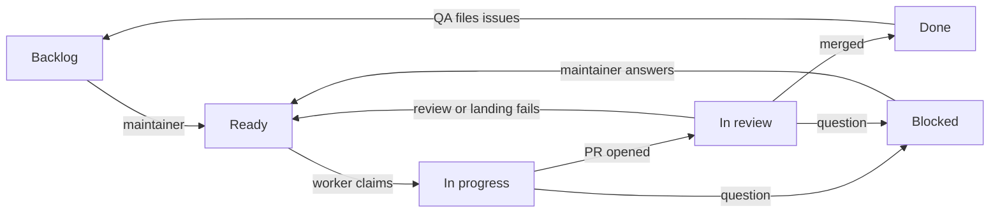

# Dev factory

How the factory works now. History and rationale live in
[plans/2026-09-25-dev-factory-design.md](plans/2026-09-25-dev-factory-design.md).

## Flow

Work state lives in the Status field of the project board
[tvararu/1](https://github.com/users/tvararu/projects/1). Design:
[plans/2026-09-26-project-board-design.md](plans/2026-09-26-project-board-design.md).



Roles are Orca automations running `omp` through `src/factory/omp-factory`,
each in a fresh `auto-*` worktree, from the runner clone
`~/.local/share/tuicraft-factory/runner` (follows `origin/main`). Orca's
`agentCmdOverrides.omp` is `~/.local/bin/omp-factory`, a symlink to the
runner's wrapper that `bun src/factory/main.ts setup wrapper --apply`
installs, so the wrapper and its `omp-factory.yml` follow `main`. The wrapper
passes that file as `--config` to factory roles, so they run with omp memory
and autolearn off. Prompts are in `src/factory/prompts/`. Every role starts
with `bun src/factory/main.ts precheck <role>` and stops on exit 1.

## Status

| Status | Moved there by | Meaning |
|---|---|---|
| Backlog | GitHub's auto-add, for every new issue | Filed, not started |
| Blocked | any agent, with a comment | Waits on the maintainer; the comment says what the problem is and what to do |
| Ready | the maintainer; agents only when an open factory PR exists | Work on this (rework if a PR is open); oldest first |
| In progress | worker, on claim | A worker owns it |
| In review | worker, on opening the PR | Reviewer, then merger |
| Done | GitHub, on merge or close | Landed or closed |

Moving a card to Ready is the whole release step. No agent moves a card to
Ready unless it already has an open factory PR, no agent @-mentions anyone,
and the Blocked group is the maintainer's inbox. An issue with an open
blocked-by issue stays where it is and is never picked up or landed.

`bun src/factory/main.ts status <issue>` prints a card's Status;
`status <issue> <backlog|blocked|ready|in-progress|in-review|done>` sets it
(adding the issue to the board if missing) and refuses `ready` without an
open `factory/<N>-…` PR.

Comments on the issue are the per-run locks:

- `<!-- factory:claim <run> -->`: a worker's claim. Live for 3 h and only
  if newer than the card's last Status change.
- `<!-- factory:claim <run> <sha> -->`: a reviewer's claim on one head. Live
  for 1 h.
- `<!-- factory:landing <run> -->`: the merger's landing claim. Live for
  1 h; `bun src/factory/main.ts landings` lists the live ones, oldest first,
  and the oldest wins.

## Roles

- **Worker.** Takes the oldest Ready card with no live claim, moves it to In
  progress, keeps one workpad comment, live-tests on its own SOAP account,
  opens a PR from `factory/<N>-<slug>` and moves the card to In review. A
  Ready card with an open factory PR is rework. The PR title is the future
  commit subject (Conventional, ≤ 50 chars); the body opens with a why
  paragraph, then `Fixes #N` and `## Proof`. Commits inside the PR don't
  matter. At most 3 attempts per issue, then Blocked.
- **Reviewer.** Takes In review cards whose PR head lacks `factory/review`.
  Runs `mise ci` on the head and posts `factory/ci`, judges the outcome and
  code, and posts `factory/review`. Pass leaves the card In review for the
  merger; fail moves it back to Ready; a product question moves it to
  Blocked. Never runs `mise test:live`: it judges the implementer's proof.
  If an earlier head passed review and the new head's zero-context patch
  matches it (`same-patch`), the review carries over after CI. Claims are
  per head SHA.
- **Merger.** The precheck first bounces In review cards whose head moved
  after a passing review: it comments "head changed since review" and the
  card stays In review, so the reviewer checks the new head. The third moved
  head moves the card to Blocked with a comment. It then lands one PR at a
  time: rebase onto `main`, `same-patch` against the reviewed head (differs:
  back to review), `mise ci`, push, then
  `gh pr merge --squash --match-head-commit`. A conflict or failing CI sends
  the card back to Ready with a comment. On merge GitHub moves the card to
  Done.
- **QA.** Runs when `main` moves. Maps new commits to PRs and issues via
  trailers, smoke-tests and plays, and files problems as OpenHubris issues
  without labels; auto-add puts them in Backlog.
- **Reaper** (systemd timer, 5 min). Removes finished or over-cap `auto-*`
  worktrees that are clean and pushed or landed, and other worktrees that
  are landed, clean and idle over 12 h. Dirty trees are archived to
  `tmp/worktree-archive-<date>/`. Each hold is one draft card in Blocked,
  `Reaper: <worktree> held (<reason>)`, saying what to do; the reaper
  deletes it once the hold clears.

## Cutover from labels

The factory used workflow labels before the board. The first reaper run
after the board change landed puts every open issue on the board with its
Status mapped from its labels, first match wins: `agent:working` → In
progress; `needs:pm` without `ready` → Blocked; `agent:review`,
`agent:reviewing`, `agent:merging` or `agent:landing` → In review;
`agent:rework` or `ready` → Ready. An issue with no other label (none,
or only `qa:found` or `p1`) keeps its Status, or goes to Backlog if it is
not on the board yet.
It then removes the legacy labels from every issue, deletes them from the
repo, and closes the open `Reaper: … held` issues with a comment. Later
runs find nothing to migrate.

## Landing

`main` is squash-only with linear history. Required statuses: `signoff/ci`
(pre-push hook), `factory/ci`, `factory/review`. Each PR becomes one
commit, authored by OpenHubris:

```
<PR title>

<PR why paragraph, wrapped at 72>

Refs: #<each closed issue>
PR: #<pr>
Co-authored-by: Theodor Vararu <theo@vararu.org>
```

`bun src/factory/main.ts squash-message <pr>` builds it and fails on a bad
title, missing why, or no closed issue. Revert with one `git revert <sha>`.

## Stacked PRs

When an issue needs another open PR's code: the child issue is blocked by
the parent's issue, the child PR's base is the parent's branch, and its body
has `Stacked-on: #<parent PR> <parent tip>`. After the parent lands, GitHub
retargets the child to `main` and the merger runs
`git rebase --onto origin/main <parent tip>`. At most 2-3 deep.

## Pace

`mise factory:pace [default|max]` sets schedules and caps.

| | default | max |
|---|---|---|
| Worker | every 3 min, 3 in flight | every 2 min, 6 |
| Reviewer | every 3 min, 3 in flight | every min, 6 |
| Merger | every 10 min | every 3 min |
| QA | every 30 min | every 15 min |

Run caps: worker 3 h, QA 2 h, reviewer and merger 1 h.
