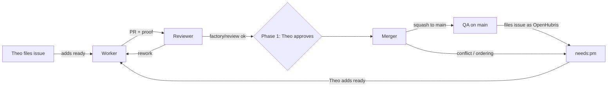

# Dev factory: initial design

Date: 2026-09-25. Status: initial design; phase 0 probes run on 2026-09-25
(see [Phase 0 findings](#phase-0-findings)), phase 1 not started. Research and
citations: [2026-09-25-dev-factory-research.md](2026-09-25-dev-factory-research.md).

This doc has two jobs. It records the shape of the factory we start with, and
it keeps every idea we considered. If the first design proves wrong, go back to
the [idea register](#idea-register) before inventing something new.

## Intent

Theo (`tvararu`) stops reviewing tuicraft code and acts as product manager.
He files issues in product terms and judges the result, not the diff. Agents
take issues through implementation, review, merge and QA on `main`, and QA
files the bugs it finds as new issues. The factory runs 24/7 on the VM.

Success means:

- An issue Theo files reaches `main` with no human code work.
- Theo can judge each result from what an agent attaches to the issue or PR
  (proof) without opening the diff.
- Token cost stays far below Gas Town's. We borrow Symphony's weight class,
  not its model settings.
- Theo's gates are explicit, and each one can be switched off when the agents
  have earned it.

### Decisions Theo made

- Start from OpenAI Symphony's design. Nothing from Gas Town for now.
- Build it from GitHub and Orca. No extra orchestrator product.
- Everything runs locally on the VM: no GitHub Actions runners, no other VMs.
  CI is `mise ci` run by the factory on the VM.
- Roll out in phases. In phase 1 Theo keeps final say on PRs. That gate may be
  removed later. We design for reviewer agents becoming good enough ("skate to
  where the puck will be") and accept that they are not fully there yet.
- Merging is a separate agent's job. It wakes up periodically, looks at open
  PRs that pass CI, orders them by priority, lands them, and flags ordering or
  conflict problems to Theo.
- No GitHub merge queue and no move to an organization. Symphony does not need
  either.
- Each agent does its own live testing on its own game account. Accounts are
  created and torn down through the server's SOAP interface. Level and gear
  presets are available.
- Only issues opened by `tvararu` are worked on at first. Public issues from
  anyone else are ignored until a later phase.
- Theo enabled squash and merge commits on 2026-09-25. Both default to the PR
  title and description.

### Assumptions (correct if wrong)

- The tracker is GitHub Issues, with labels as states. Linear is an optional
  cockpit for Theo later, not part of phase 1.
- `main` keeps `required_linear_history`, and PRs land by squash, one commit
  per issue. Merge commits are enabled in repository settings, but the ruleset
  still refuses them on `main`. That only changes if we drop linear history
  (see the register).
- Each factory role is an Orca Automation. Phase 0 confirmed that `omp`
  works as an automation provider, with three gaps the factory must close
  itself: no per-run time cap, no worktree or process cleanup, and no setup
  script in automation worktrees (see [Phase 0 findings](#phase-0-findings)).
- Dispatch needs a `ready` label added by Theo (option 2 below). This was
  recommended but not explicitly confirmed.

## Shape



### Identities

| Identity | Role | Access |
|---|---|---|
| `tvararu` | PM. Files issues, adds `ready`, approves PRs in phase 1 | admin |
| `OpenHubris` | All factory agents. Opens PRs, posts statuses, merges | write |

GitHub never lets a PR author approve their own PR. `OpenHubris` authors every
factory PR, so in phase 1 "1 required approval" means Theo's approval without
extra configuration.

### Scope rule

An issue is in scope when it is open, its author is `tvararu`, and it has the
`ready` label. Everything else is ignored, including issues that factory QA
files as `OpenHubris`: those get `needs:pm` and wait until Theo adds `ready`.
This rule also acts as the human gate on work that agents find.

### States

Labels are the only state store. There is no database, and every role can
work out the state again from GitHub after a crash.

| Label | Meaning | Set by | Cleared by |
|---|---|---|---|
| `ready` | Theo wants this worked on | Theo | Worker on claim |
| `agent:working` | A worker owns the issue | Worker | Worker on PR |
| `agent:review` | PR waits for review | Worker | Reviewer |
| `agent:rework` | Reviewer or merger wants changes | Reviewer, Merger | Worker on claim |
| `agent:merging` | Reviewed, waiting for the merger | Reviewer | Merger |
| `needs:pm` | Theo must decide something | Any role | Theo |
| `qa:found` | Filed by QA | QA | nobody |

Closed means done. PRs close their issue with `Fixes #N` in the body.

### Roles

Each role is one Orca Automation. `--precheck` is a cheap `gh` query that
exits non-zero when there is nothing to do, so an empty poll costs no tokens.

**Worker.** Trigger: every 5 minutes. The precheck passes when a `ready` or
`agent:rework` issue with no open blocked-by dependency exists and fewer than
`WIP` issues have `agent:working`. Runs of one automation overlap (phase 0),
so the WIP count and the claim re-read are the only concurrency guards.

1. Claim one issue, highest priority first, skipping any issue whose
   `blockedBy` list has an open issue (Symphony's "not blocked" rule). Swap
   `ready` for `agent:working`, then re-read the issue to detect a race with
   another run.
2. Start with `mise trust -y && mise bundle`: automation worktrees do not run
   the repo setup script (phase 0).
3. Work in a fresh worktree per run (`--workspace-mode new-per-run`), on a
   branch named `factory/<issue>-<slug>`. For rework, reuse the existing
   branch.
4. Keep exactly one workpad comment on the issue (Symphony's "Codex Workpad"),
   edited in place. First write the acceptance criteria and test plan, then
   update progress and blockers.
5. Create a SOAP account and character for this run. Live-test against the
   real server, and tear the account down at the end.
6. Open or update the PR as `OpenHubris` with `Fixes #N` and proof attached
   (below). Set `agent:review`.
7. Stop conditions: a per-run time cap enforced by the reaper (below), a cap
   on attempts per issue, and a `needs:pm` escalation instead of spinning.

**Reviewer.** Trigger: every 10 minutes. The precheck passes when a PR's issue
has `agent:review`.

1. Start from a fresh context with a skeptical prompt. It gets the diff, the
   issue, the workpad and the proof, but not the worker's transcript.
2. Run `mise ci` on the PR head in its own worktree. Post the commit statuses
   `factory/ci` and `factory/review` to the head SHA.
3. If it passes, set `agent:merging`. Otherwise post one review comment and
   set `agent:rework`.

**Merger.** Trigger: hourly. The precheck passes when an issue has
`agent:merging` and (phase 1) its PR has `reviewDecision == APPROVED`. An
unapproved PR must not wake the merger every hour to find nothing to land.

1. List candidate PRs: `factory/ci` and `factory/review` pass, and (phase 1)
   Theo has approved.
2. Order them by issue priority, then by age. Flag dependency or ordering
   ambiguity with `needs:pm`.
3. One at a time: rebase onto `main`, run `mise ci` again, post new statuses
   on the new head, and squash-merge. On a conflict it cannot resolve cleanly,
   set `agent:rework` with a note.

**QA.** Trigger: when `main` has moved since the last QA run. The precheck
compares `git rev-parse origin/main` with a stored SHA.

1. Run a smoke test and live scenarios against the real server on its own
   SOAP account.
2. Before filing, search for duplicates in open and recently closed issues.
   File as `OpenHubris` with `qa:found` and `needs:pm`. If `main` is badly
   broken, file one issue that names the commit that caused it.

**Reaper.** Not an agent. Orca marks a run `completed` when the agent goes
idle, but the interactive `omp` process and the worktree stay until the
worktree is removed (phase 0), and automations cannot pass `--max-time`. A
precheck-only automation, or a cron'd shell script, lists automation
worktrees (`auto-<name>-run-N-<ts>`) and runs `orca-ide worktree rm` on those
whose run is `completed` or older than the role's time cap. `worktree rm`
kills the session and deletes the branch. Branches the worker pushed survive,
because the PR branch is `factory/<issue>-<slug>`, not the run branch.

### Local CI and statuses

The factory runs `mise ci` itself and posts results with
`gh api repos/tvararu/tuicraft/statuses/<sha> -f state=… -f context=factory/ci`.
The ruleset then requires `factory/ci` and `factory/review`. This needs no
runner and matches the repo's existing hook-based CI. Anyone with write access
can post these statuses. Today that is only `tvararu` and `OpenHubris`, so the
risk is accepted.

`gh signoff` is an option for posting. `mise ci` already posts `signoff/ci`
through it when HEAD is clean and pushed, and the pre-push hook posts it for
the pushed HEAD. The extension only posts `success`, only for the local HEAD,
and only under `signoff` or `signoff/<name>` contexts, so it cannot post
`factory/*` or a failure state. Use `gh api` for those, and keep the two
namespaces separate.

### Proof for the PM

Each PR has a "Proof" section: the live commands the worker ran and their
output (daemon transcript excerpts), plus the acceptance checklist from the
workpad with each item marked pass or fail. This is how Theo judges outcomes
in phase 1. Later options are in the register: terminal recordings, digests,
Linear Pulse.

Two cases need more than a transcript:

- TUI and harness work: attach a text capture of the rendered screen. The
  minimum is a detached tmux session at a fixed size, then
  `tmux capture-pane -p` after each step (checked in phase 0 on
  `bun src/main.ts --help`). No new dependency.
- Refactor-only issues with no visible outcome: the Proof section says so,
  and names what stayed the same: `mise ci` and `mise test:live` pass on the
  PR head, with their output. The reviewer then judges the diff against the
  issue's stated invariant instead of looking for a new behavior, and rejects
  any behavior change the issue did not ask for.

### Limits

- `WIP`: at most N concurrent workers, enforced by the precheck count. Start
  at 2.
- Per-run time cap on every role, enforced by the reaper. Orca launches
  `omp '<prompt>'` with no flags, so `--max-time` is not available.
- A cap on attempts per issue, after which the issue gets `needs:pm`.
- Bot-authored issues never dispatch on their own (scope rule). This stops QA
  from feeding itself in a loop.
- Daily token budget: not yet enforced. Orca records no usage for omp runs
  (`usage.status: unavailable`, "This agent does not report usage to Orca
  yet"). See open questions.

## GitHub configuration

`OpenHubris` has no admin access, so Theo applies these by hand. Labels need
only triage access, and the factory creates them itself in phase 1.

Apply these **at the phase 1 cutover, not before**. Requiring PRs on `main`
blocks the direct pushes that current work depends on.

1. Settings → Rules → Rulesets → `main` → edit:
   - Keep: Restrict creations, Restrict deletions, Block force pushes,
     Require linear history.
   - Add **Require a pull request before merging**: 1 required approval,
     dismiss stale approvals on new commits, allowed merge methods: Squash.
   - Add **Require status checks to pass**: `factory/ci`, `factory/review`.
     Turn on "Require branches to be up to date before merging". The merger
     rebases anyway.
   - Bypass list: add Repository admin (Theo) so emergency fixes stay
     possible.
2. Phase 2: change required approvals from 1 to 0. Everything else stays.

Already done by Theo on 2026-09-25: squash and merge commits enabled, default
commit message set to PR title and description. Rebase merge and auto-merge
remain enabled.

## AGENTS.md changes at cutover

The current shipping rules assume one integration owner who cherry-picks onto
`main` with no PRs. At cutover:

- Replace "One integration owner commits and pushes to `main`. No PRs." with
  the factory flow: PRs from `OpenHubris`, merged only by the merger.
- Remove the cherry-pick integration guidance, or keep it only for the admin
  bypass.
- Change "Always run `mise test:live` yourself" to per-agent live testing on
  SOAP-created accounts. The two fixed test accounts stay for `mise test:live`
  until it provisions its own.
- The one-owner-per-character rule still holds, and per-run accounts satisfy
  it without locking.

## Phases

**Phase 0: probes.** These are throwaway tests that answer questions, not
code to keep.
- Does `orca automations create --provider omp` start an omp session with the
  prompt in a new worktree? Do runs of the same automation overlap?
- Is `omp -p` exit status meaningful? Can a run end cleanly with a result the
  next role can read?
- SOAP: create an account, create a character at a preset level and gear,
  delete the account. Collect the credentials Theo supplies and keep them out
  of git.
- Exit: each question is answered yes or no, with the fallback chosen.
- Result: see [Phase 0 findings](#phase-0-findings). Automations and `omp -p`
  are answered. SOAP is pending the provisioning report from t1.

**Phase 1: the loop with Theo approving.** Roles, labels, statuses, the
ruleset change and the AGENTS.md cutover. Exit: several real issues land
through the loop with no human code work. Theo only adds `ready` and approves.

**Phase 2: remove Theo's approval.** Required approvals go to 0. Candidate
additions: holdout scenarios, a reviewer on a different model. Exit criteria
are for Theo to set from phase 1 experience.

**Phase 3: public issues.** A triage agent handles outside issues: dedupe,
reproduce, rewrite as acceptance criteria, then ask Theo to add `ready` or
decide itself. The same scope rule applies, widened.

## Phase 0 findings

Run on 2026-09-25 from the `dev-factory` worktree, with Orca 1.4.205 and
omp 18.3.1. Every automation and worktree created was removed afterwards;
`orca-ide automations list` reports "No automations found".

### 1. Orca Automations with omp: yes

Commands (the repo id is tuicraft's Orca repo):

```sh
orca-ide automations create --name probe-factory-overlap \
  --trigger '* * * * *' --provider omp --repo id:<repo> \
  --workspace-mode new-per-run --base-branch main --precheck true \
  --prompt 'Run exactly this one shell command … : echo "start $(date -Is)
  pwd=$(pwd) branch=$(git branch --show-current)" >> tmp/probe/log.txt;
  sleep 150; echo "end …" >> tmp/probe/log.txt'
orca-ide automations create --name probe-factory-skip \
  --trigger '* * * * *' --provider omp --repo id:<repo> \
  --workspace-mode new-per-run --base-branch main \
  --precheck 'echo precheck-ran $(date -Is) >> tmp/probe/log.txt; exit 1' \
  --prompt 'Reply SKIPTEST and stop.'
orca-ide automations runs --id <id> --json
orca-ide automations edit <id> --disabled
orca-ide automations remove <id>
orca-ide worktree rm --worktree name:auto-probe-factory-overlap-run-N-<ts>
```

| Question | Answer | Evidence |
|---|---|---|
| Does `--provider omp` start an omp session with the prompt? | Yes | The run's `outputSnapshot` starts `$ omp 'Phase 0 probe. …'`, and the command in the prompt ran |
| In a new worktree? | Yes | Each run logged its own `pwd=…/auto-probe-factory-overlap-run-N-<ts>` and `branch=OpenHubris/auto-probe-factory-overlap-run-N-<ts>`, based on `main` (`e282e09`) |
| Do overlapping runs run concurrently, queue, or get skipped? | Concurrently | Runs 1, 2 and 3 started at 20:38:19, 20:39:19 and 20:40:19. Run 1 only ended at 20:40:49, so three sessions were live together |
| Does `--precheck` skip cleanly on non-zero exit? | Yes | Three runs recorded `status: skipped_precheck`, `exitCode: 1`, `dispatchedAt: null`, `workspaceId: null`: no worktree, no terminal, no agent |
| What does a skip cost? | No tokens, no worktree | The precheck took 8-9 ms. A realistic `gh issue list -R tvararu/tuicraft --label ready --author tvararu …` precheck takes about 0.6 s and one of 5,000 API requests per hour |
| Does Orca see a run end? | Yes | Each run went from `dispatched` to `completed` about 7 s after the agent's final reply |

Gaps found, and how the design closes them:

- **The process and the worktree outlive the run.** Orca launches the
  interactive TUI (`omp '<prompt>'`), not `omp -p`. After `completed`, the
  three `omp` processes were still alive (192-332 s elapsed) until
  `orca-ide worktree rm`, which killed them and deleted the run branches.
  Fix: the reaper role.
- **No per-run time cap.** The launch has no flags. Orca has only global
  per-agent settings (`agentDefaultArgs`, `agentCmdOverrides` in
  `~/.config/orca/profiles/local-default/orca-data.json`), which would also
  change Theo's interactive sessions. omp has no settings key for a session
  time limit, only the `--max-time` flag. Fix: the reaper enforces the cap.
- **The setup script does not run.** The run 1 worktree had no
  `node_modules` five minutes after creation, although the repo's Orca setup
  (`mise trust -y && mise bundle`) is `run-by-default` for
  `worktree create`. Fix: every role prompt starts with that command.
- **No usage data.** Every run recorded `usage.status: unavailable`,
  `provider_unsupported`. The token budget needs another data source (see
  finding 2).
- The scheduler fired about 16 s after each minute boundary, and a precheck
  has a 60 s default timeout. `missedRunPolicy` defaults to
  `run_once_within_grace` with a 720-minute grace, so downtime produces one
  catch-up run, not a burst.

Decision: keep Orca Automations as the engine. None of the gaps is a
fallback trigger. The poller fallback was for "can't run omp, overlap
runs, or cap concurrency". Automations run omp and overlap, and the precheck
count caps concurrency.

### 2. `omp -p` as a role runner: partly

```sh
omp -p --no-session --no-title --thinking off "Reply with exactly the word OK …"   # exit 0, prints OK
omp -p --no-session --no-title --model does-not-exist-xyz "hi"                        # exit 1, "Model … not found"
omp -p … --max-time 15 "Run 'sleep 60' …, then reply DONE."                           # exit 0 after 16 s, prints nothing
omp -p … "Run the shell command 'false'. Then reply FAILED …"                          # exit 0, prints FAILED
omp -p … --mode json --max-time 10 "Run 'sleep 60' …"                                  # agent_end, last message toolResult "Command aborted"
omp -p … "Write {…\"state\":\"agent:review\"…} to handoff.json …"; omp -p … "Read handoff.json …"   # prints agent:review
```

| Question | Answer | Evidence |
|---|---|---|
| Is the exit status meaningful? | Only for startup failure | Exit 1 for a bad model. Exit 0 for success, for a task the agent reports as failed, and for a `--max-time` abort |
| Can the outcome be read reliably anyway? | Yes, with `--mode json` | In `agent_end`, a clean finish has a last message with `role: assistant` and `stopReason: stop`. A timed-out run ends on `role: toolResult` with "Command aborted" |
| Can a run end with a result the next role reads? | Yes | One run wrote `handoff.json`, and a second run read `agent:review` back. Labels and comments are the same pattern through `gh`. They were not exercised on GitHub, to keep real issues untouched |
| Is usage data available? | Yes | Each assistant `message_end` event has `usage.cost.total`. The trivial run cost $0.10 with a cold cache and $0.006 with a warm one |

Automations do not use `omp -p`, so this matters for the fallback poller
and for token accounting. A role must never signal its result through the
exit code. Its result is the GitHub state it leaves (labels, statuses,
workpad).

### 3. SOAP: pending

Theo is provisioning the SOAP credentials and template characters on t1
through a separate agent. This probe waits for that report. Verified so far:

- `t1:7878` answers. A request with no credentials gets HTTP 401, and wrong
  credentials get an empty reply. `ACSoap.cpp` returns 401 for a missing
  login, an unknown account or a bad password, and 403 when the account's
  security level is below `SEC_ADMINISTRATOR`.
- Console-capable commands (`Console::Yes`) exist for the whole lifecycle:
  `account create <name> <pass>`, `account delete <name>` (which also deletes
  the account's characters), `character level <name> <level>` (works
  offline), `pdump copy <character> <account> [<newname>]`,
  `send items <name> "<subject>" "<text>" <item[:count]> …` (works offline,
  by mail). `additem` needs the character online.
- No command creates a character. Theo chose presets as template characters
  cloned with `pdump copy` into the run's account, already levelled and
  geared.
- Credentials will live in `~/.config/tuicraft-factory/soap.env`, mode 0600,
  outside every worktree.

## Open questions

- ~~Can Orca Automations run `omp`, and can one automation's runs overlap?~~
  Yes and yes (phase 0). Automations stay the engine.
- Token budget: what daily cap, and how is it enforced? Orca reports no omp
  usage. The data has to come from omp session files or `--mode json`
  `usage.cost`. `omp usage`/`omp stats` are still unexamined.
- Which models fit each role? Reviewer diversity is in the register. An
  automation cannot choose the model per role, because the launch has no
  flags. That needs an omp profile or config per role.
- ~~Where do SOAP credentials live?~~ `~/.config/tuicraft-factory/soap.env`,
  mode 0600, outside every worktree.
- How do factory workers get model access for live proof of harness features
  (Pi needs a provider) without sharing Theo's refresh tokens? Proposal: a
  factory-owned credential, either an API key with a spend limit in the
  factory env file, or one Pi `/login` into a factory-only agent dir.
  Theo decides, alongside harness milestone 3.
- How does priority get expressed: labels such as `p1`/`p2`, or issue order in
  a GitHub Project?
- Should QA's live scenarios become a holdout set that workers cannot read?
  Where would it live so worktrees don't include it?
- Leftover SOAP accounts from crashed runs: sweep by name prefix and age?
  The reaper is the natural owner.

## Idea register

Status: **adopted** (in the initial design), **deferred** (a good idea for
later), **rejected** (considered and not wanted now, with the reason). All
sources are in the research doc.

### Tracker and control plane

| Idea | Status | Why / when to revisit |
|---|---|---|
| GitHub Issues + labels as state machine | adopted | Free, native, and Orca `worktree create --issue` already links issues |
| Linear as tracker (agents as workspace members, delegation, agent sessions) | deferred | Its real value is on the PM side: live session view, phone triage, Pulse. Linear's own agents run in its cloud and can't use omp, the VM or SOAP. A custom omp agent needs a public webhook plus a ~300-600 line bridge, or Cyrus. Orca already has `orca linear` commands and `--linear-issue`. Revisit if GitHub feels poor as Theo's cockpit. Free/Basic is enough |
| Linear Business (Triage Intelligence, Asks, Loops) | rejected | Cost, and it assumes Linear-hosted agents |
| GitHub Projects board for priority and ordering | deferred | Candidate answer to the priority question |

### Dispatch gate (Theo's first gate)

| Idea | Status | Why / when to revisit |
|---|---|---|
| 1. Any open `tvararu` issue dispatches immediately | rejected for now | Simplest, but Theo can't park ideas as issues |
| 2. `ready` label added by Theo dispatches | adopted (pending Theo's confirmation) | Symphony's `Backlog → Todo`. Filing and dispatching are separate |
| 3. Triage agent first writes acceptance criteria and a test plan, then Theo adds `ready` | deferred | Better definition of done for one more round trip. For now the worker writes criteria into its workpad. Natural fit for phase 3 |
| Label-only scope (anyone's issue once `ready`) | deferred | Needed for public issues. `ready` needs triage rights, so outsiders can't set it |
| Skip issues with an open blocked-by dependency in the precheck and claim | adopted | Symphony's "not blocked" eligibility rule. Theo can then ready a whole epic's sub-issues at once. `gh issue list --json blockedBy` supports it |
| Theo only readies unblocked issues | rejected | Pushes dependency bookkeeping onto the PM, and one slip starts a worker on a blocked issue |

### Orchestration

| Idea | Status | Why / when to revisit |
|---|---|---|
| Orca Automations, one per role, with `gh` prechecks | adopted, confirmed in phase 0 | No code to write: cron/RRULE, precheck skip, worktree per run. omp starts with the prompt, runs overlap, and precheck skips cost no tokens |
| Symphony-style Bun poller (tracker poll, per-state concurrency caps, retry/backoff, reconcile on restart) | fallback, not triggered | Use if Automations can't run omp, overlap runs, or cap concurrency. Phase 0 found none of these. Revisit if the reaper, time cap or per-role model choice becomes painful: a poller could run `omp -p --max-time --model --mode json` directly |
| Reaper: remove completed or over-time automation worktrees with `orca-ide worktree rm` | adopted | Phase 0: the omp process and worktree outlive each run, and automations can't pass `--max-time` |
| Global Orca `agentDefaultArgs`/`agentCmdOverrides` for omp flags (`--max-time`, `--model`) | rejected | They apply to every omp launch, including Theo's interactive worktrees |
| Run Symphony's Elixir reference directly | rejected | Built around Codex app-server; Elixir runtime; engineering preview |
| Orca orchestration (Runs, Tasks, Dispatch, supervised workers, decision gates) | deferred | Use if we need supervised runs or DAGs across agents |
| omp built-in task/worktree/agent features | deferred | Theo is unsure they fit. Keep one control plane (Orca) |
| Gas Town + Beads (Mayor, Polecats, Witness, Deacon, Refinery) | rejected | Heavy and token-hungry, est. $2-5k/month, author warns against serious use. The ideas to keep: a merge-queue role (adopted as the merger) and disposable sessions with durable task state (adopted: labels + workpad) |
| Ralph loop (bash `while`, one item per iteration, fresh context, `progress.txt`, max iterations) | partly adopted | Fresh context per run and one item per run are adopted |
| Anthropic long-running harness (feature JSON pass/fail, `init.sh` smoke test at session start) | partly adopted | Acceptance checklist in the workpad. Smoke-first is deferred |
| Claude Code agent teams / subagents | rejected | "Significantly more tokens". Experimental |
| Vibe Kanban, Conductor, Sculptor, Crystal, claude-squad, Terragon | rejected | Human-dispatched UIs that don't provide the loop. Several have shut down |
| Hosted agents: Copilot coding agent, gh-aw, claude-code-action, Codex cloud, Cursor, Devin, Factory | rejected | They run in a cloud that can't reach the VM, omp or SOAP. Most require a human to merge. Copilot automations are private-repo only |
| Hierarchical supervisors / heartbeat nudging | rejected | A poller that relaunches does the same job more cheaply |
| Spec → design → tasks dependency waves (Kiro, spec-kit) | deferred | Useful when one issue should fan out into sub-issues |
| Map-style AGENTS.md (~100 lines) plus a doc-gardening agent | deferred | Keeps context cheap as the repo grows. A periodic automation later |

### Merging

| Idea | Status | Why / when to revisit |
|---|---|---|
| Merger agent: periodic, priority order, rebase + re-test + squash, `needs:pm` on ambiguity | adopted | Theo's design. Same as Symphony's `Merging` state plus its `land` skill |
| GitHub native merge queue | rejected | Only available to organizations. Not needed, since Symphony lands without it. Revisit if merge throughput becomes the bottleneck (a free org for an open-source project) |
| Squash merge with linear history kept | adopted | One commit per issue. No GH013 surprises |
| Merge commits with linear history dropped | deferred | Theo enabled merge commits. Revisit only if per-commit history inside PRs turns out to matter |
| Auto-merge button driven by required checks | deferred | Could replace the merger's final step. The merger still decides order |
| Bot approvals satisfying required reviews (GitHub App or Copilot review approvals) | deferred | Unverified for custom Apps. Needed only if phase 2 wants a review record, not 0 approvals |
| Separate GitHub Apps for worker and reviewer, with App-pinned required checks | deferred | Stops a worker from posting its own review status. Worth doing if the reviewer is ever gamed |

### Verification and quality

| Idea | Status | Why / when to revisit |
|---|---|---|
| `mise ci` as a required local status | adopted | Existing gate, no runners |
| Separate skeptical reviewer with a fresh context | adopted | Agents rate their own work too highly |
| Per-agent live testing on SOAP-created accounts | adopted | Removes the scarce-account constraint and the character lock |
| Proof section per PR (transcripts, acceptance checklist) | adopted | Theo's phase 1 surface |
| Acceptance criteria before work (workpad), with the issue's Validation/Test Plan sections treated as non-negotiable | adopted | Symphony convention. Stops "declared done" too early |
| Holdout scenarios workers can't read, LLM-judged satisfaction (StrongDM) | deferred | Strongest replacement for human review. Target for phase 2. Needs a location outside worktrees |
| Acceptance tests the author can't edit (locked test files) | deferred | Agents cheat on tests they can edit (ImpossibleBench) |
| Reviewer on a different model | deferred | Mixed evidence: Claude reviewing Codex went 72→90%, Codex reviewing Claude went 91→83% |
| Paid AI reviewers (Copilot review, Claude Code Review, Bugbot, CodeRabbit, Greptile) | rejected for now | Cost per PR or per seat. Greptile's free tier excludes AGPL. Our own reviewer runs locally |
| Digital twin: grow the mock world server into a validated clone | deferred | Theo: we use the one real server. Mock stays for unit/integration tests |
| Private AzerothCore in Docker | rejected | Theo: one server, and accounts are trivial |
| Revert-on-red for `main` after QA | deferred | Reverts are plain commits and compatible with linear history. Candidate QA action once QA is reliable |
| tmux `capture-pane -p` text snapshots of the rendered screen in the Proof section | adopted for TUI and harness issues | Minimum proof for screen output with no new dependency. Checked in phase 0 |
| Terminal recordings (VHS GIFs), Showboat-style demos | deferred | Richer proof than text snapshots |
| Daily or weekly digest (Linear Pulse-like) | deferred | PM surface for phase 2 when Theo stops approving |
| QA dedupe via parallel searches, filter agent, 3-day grace close, author 👎 veto (anthropics/claude-code) | partly adopted | Duplicate search is adopted. Grace-close and veto come in phase 3 |
| Cleanup agent (dead code, stale branches, leftover accounts) | partly adopted | The reaper covers worktrees and leftover SOAP accounts. The rest is a periodic automation later |

### Limits and safety

| Idea | Status | Why / when to revisit |
|---|---|---|
| WIP cap via precheck count | adopted | Cheap and explicit |
| Per-run time cap, attempt cap per issue, escalate to `needs:pm` | adopted | Symphony and Attractor stop conditions |
| Bot-authored issues never dispatch on their own | adopted | Prevents runaway QA → worker loops. Same idea as gh-aw's "bot events trigger nothing" |
| Daily token/credit cap (gh-aw default ~$50/day) | deferred | Needs a data source. Orca reports no omp usage. omp's `--mode json` `usage.cost` and session files have it |
| Factory-owned model credential for live Pi proof (spend-limited API key, or a factory-only Pi `/login`) | deferred (Theo decides) | Workers must not share Theo's refresh tokens. Decide together with harness milestone 3, before the first harness issue gets `ready` |
| Loop detection / goal gates (StrongDM Attractor) | deferred | Add if workers spin |
| Self-hosted GitHub runners | rejected | GitHub says they're unsafe on public repos, and Theo wants everything local |
| `gh webhook forward` or a public webhook receiver | rejected | Not for production. Polling uses ~120 requests/hour out of 5,000 |
