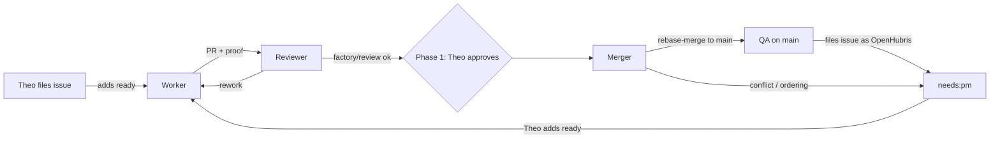

# Dev factory: initial design

Date: 2026-09-25. Status: initial design; phase 0 probes run on 2026-09-25
(see [Phase 0 findings](#phase-0-findings)), phase 1 not started. Research and
citations: [2026-09-25-dev-factory-research.md](2026-09-25-dev-factory-research.md).

This doc has two jobs. It records the shape of the factory we start with, and
it keeps every idea we considered. If the first design proves wrong, go back to
the [idea register](#idea-register) before inventing something new.

## Intent

Theo (`tvararu`) stops reviewing tuicraft code and acts as product manager.
He files issues in product terms and judges the result, not the diff. Agents
take issues through implementation, review, merge and QA on `main`, and QA
files the bugs it finds as new issues. The factory runs 24/7 on the VM.

Success means:

- An issue Theo files reaches `main` with no human code work.
- Theo can judge each result from what an agent attaches to the issue or PR
  (proof) without opening the diff.
- Token cost stays far below Gas Town's. We borrow Symphony's weight class,
  not its model settings.
- Theo's gates are explicit, and each one can be switched off when the agents
  have earned it.

### Decisions Theo made

- Start from OpenAI Symphony's design. Nothing from Gas Town for now.
- Build it from GitHub and Orca. No extra orchestrator product.
- Everything runs locally on the VM: no GitHub Actions runners, no other VMs.
  CI is `mise ci` run by the factory on the VM.
- Roll out in phases. In phase 1 Theo keeps final say on PRs. That gate may be
  removed later. We design for reviewer agents becoming good enough ("skate to
  where the puck will be") and accept that they are not fully there yet.
- Merging is a separate agent's job. It wakes up periodically, looks at open
  PRs that pass CI, orders them by priority, lands them, and flags ordering or
  conflict problems to Theo.
- No GitHub merge queue and no move to an organization. Symphony does not need
  either.
- Each agent does its own live testing on its own game account. Accounts are
  created and torn down through the server's SOAP interface. Level and gear
  presets are available.
- Theo keeps the dispatch gate: an issue is worked on only once `tvararu`
  has added its `ready` label (decided 2026-09-25, replacing "only issues
  opened by `tvararu`"). The coordinator, also `OpenHubris`, may draft and
  file issues; they wait for Theo's `ready` like any other. Public issues
  from anyone else are ignored until a later phase.
- A worker may, at its own discretion, fan out parallel omp subagents inside
  its own run and worktree and land one PR (decided 2026-09-25). See
  [Worker fan-out](#worker-fan-out).
- Merge settings trial (Theo, 2026-09-25, verified with `gh api`):
  `allow_rebase_merge=true`, `allow_squash_merge=false`,
  `allow_merge_commit=false`, and `main` keeps `required_linear_history`.
  PRs therefore land by rebase-merge, and every PR commit lands on `main`.
  Theo may relax this later.

### Assumptions (correct if wrong)

- The tracker is GitHub Issues, with labels as states. Linear is an optional
  cockpit for Theo later, not part of phase 1.
- `main` keeps `required_linear_history`, and PRs land by rebase-merge, so
  each commit of a PR becomes a commit on `main`. Squash and merge commits
  are disabled in the repository settings. That only changes if Theo ends
  the trial (see the register).
- Each factory role is an Orca Automation. Phase 0 confirmed that `omp`
  works as an automation provider, with three gaps the factory must close
  itself: no per-run time cap, no worktree or process cleanup, and no setup
  script in automation worktrees (see [Phase 0 findings](#phase-0-findings)).
- Dispatch needs a `ready` label added by Theo (option 2 below). Confirmed
  by Theo on 2026-09-25.

## Shape



### Identities

| Identity | Role | Access |
|---|---|---|
| `tvararu` | PM. Files issues, adds `ready` (the dispatch gate), approves PRs in phase 1 | admin |
| `OpenHubris` | All factory agents and the coordinator. Drafts and files issues, opens PRs, posts statuses, merges. Its own `ready` labels never dispatch | write |

GitHub never lets a PR author approve their own PR. `OpenHubris` authors every
factory PR, so in phase 1 "1 required approval" means Theo's approval without
extra configuration.

### Scope rule

An issue is in scope when it is open, has the `ready` or `agent:rework`
label, and the most recent `labeled` event for `ready` in its timeline has
actor `tvararu`. The author does not matter. Issues that the coordinator or
QA files as `OpenHubris` get `needs:pm` and wait until Theo adds `ready`.
If any agent adds `ready` itself, the latest actor is `OpenHubris` and the
issue stays out of scope. `agent:rework` issues pass because the worker
removes `ready` on claim, and removal leaves Theo's `labeled` event in the
timeline. This rule is the human gate on all work, including work that
agents find.

One GraphQL call checks the scope rule and the blocked-by rule together, so
it serves as the worker precheck (0.7 s; exits 1 when nothing is eligible):

```sh
gh api graphql \
  -f q='repo:tvararu/tuicraft is:issue is:open label:ready,agent:rework' \
  -f query='query($q:String!){search(type:ISSUE,query:$q,first:50){nodes{
    ... on Issue{number blockedBy(first:20){nodes{state}}
    timelineItems(itemTypes:LABELED_EVENT,last:50){nodes{
      ... on LabeledEvent{label{name} actor{login}}}}}}}}' \
  --jq '[.data.search.nodes[]
    | select([.blockedBy.nodes[] | select(.state=="OPEN")] | length == 0)
    | select([.timelineItems.nodes[] | select(.label.name=="ready")]
             | last | .actor.login == "tvararu")
    | .number] | if length > 0 then .[0] else error("none") end'
```

The WIP count is a second query. The claim step repeats the actor check
before it swaps labels.

### States

Labels are the only state store. There is no database, and every role can
work out the state again from GitHub after a crash.

| Label | Meaning | Set by | Cleared by |
|---|---|---|---|
| `ready` | Theo wants this worked on | Theo | Worker on claim |
| `agent:working` | A worker owns the issue | Worker | Worker on PR |
| `agent:review` | PR waits for review | Worker | Reviewer on claim |
| `agent:reviewing` | A reviewer run owns the PR's review | Reviewer | Reviewer on outcome |
| `agent:rework` | Reviewer or merger wants changes | Reviewer, Merger | Worker on claim |
| `agent:merging` | Reviewed, waiting for the merger | Reviewer | Merger |
| `agent:landing` | The one merger run is landing this issue | Merger | Merger after landing |
| `needs:pm` | Theo must decide something | Any role | Theo |
| `qa:found` | Filed by QA | QA | nobody |

Runs of one automation overlap (phase 0), so every role claims by swapping a
label and re-reading the issue. `agent:reviewing` stops two reviewers from
taking the same PR. `agent:landing` is held on at most one issue, so only
one merger lands at a time.

Closed means done. PRs close their issue with `Fixes #N` in the body.

### Roles

Each role is one Orca Automation. `--precheck` is a cheap `gh` query that
exits non-zero when there is nothing to do, so an empty poll costs no tokens.

**Worker.** Trigger: every 5 minutes. The precheck passes when an in-scope
issue (see [Scope rule](#scope-rule)) with no open blocked-by dependency
exists and fewer than `WIP` issues have `agent:working`. Runs of one
automation overlap (phase 0), so the WIP count and the claim re-read are the
only concurrency guards.

1. Claim one issue, highest priority first, skipping any issue whose
   `blockedBy` list has an open issue (Symphony's "not blocked" rule) or
   whose latest `ready` was not added by `tvararu`. Swap `ready` for
   `agent:working`, then re-read the issue to detect a race with another run.
2. Setup: Orca runs the committed `orca.yaml` setup
   (`mise trust -y && mise bundle`) before the agent starts, because the
   factory automations have `setupDecision: run` (phase 0 finding 1).
3. Work in the run's fresh worktree (`--workspace-mode new-per-run`). Check
   out `factory/<issue>-<slug>` as the worktree's branch: a new branch from
   `origin/main`, or for rework the existing remote branch. Then run
   `orca-ide worktree set --worktree active --issue <N>
   --workspace-status in-progress --comment "<one-line workpad status>"`
   (see [Orca integration](#orca-integration)).
4. Keep exactly one workpad comment on the issue (Symphony's "Codex Workpad"),
   edited in place. First write the acceptance criteria and test plan, then
   update progress and blockers.
5. Create a SOAP account and character for this run. Live-test against the
   real server, and tear the account down at the end.
6. Clean the history before review. Every commit lands on `main` on its
   own (rebase-merge), so each must stand alone: a Conventional Commit with
   a subject of 50 characters or fewer, passing the hk commit hooks and
   `mise ci`. Use `git commit --fixup` and `git rebase -i --autosquash`.
   No "WIP", "address review" or "fix typo" commits. Rework is folded into
   the commits it corrects, then force-pushed to the `factory/` branch.
7. Open or update the PR as `OpenHubris` with `Fixes #N` and proof attached
   (below). Set `agent:review` and `--workspace-status in-review`.
8. Stop conditions: a per-run time cap (the omp wrapper's `--max-time`, with
   the reaper as backstop, see [Orca integration](#orca-integration)), a cap
   on attempts per issue, and a `needs:pm` escalation instead of spinning.

<a id="worker-fan-out"></a>**Worker fan-out.** A worker may run parallel omp
subagents (the `task` tool) when an issue has independent slices. The result
is still one PR for one issue.

- Cap: at most 4 subagents per run, counted over the whole run, not only
  those running at once. The cap keeps a single run inside its time and
  token budget.
- Prefer the `sonic` agent for mechanical slices such as renames, call-site
  migration and doc updates.
- Subagents work inside the run's own worktree. Never create extra Orca
  worktrees (`orca-ide worktree create`): the reaper only sees
  `auto-<name>-run-N-<ts>` worktrees, so anything else leaks.
- A subagent that live-tests gets its own SOAP account and character, created
  and deleted like the worker's. Two agents never share one character.
- The worker owns integration: it merges the slices, runs `mise ci`, and
  writes the proof.
- Anything that could be reviewed on its own is not a subagent slice. The
  worker files it as a sub-issue (with `needs:pm`, so Theo gates it) and
  links it with blocked-by if the order matters.

**Reviewer.** Trigger: every 10 minutes. The precheck passes when a PR's issue
has `agent:review`.

1. Start from a fresh context with a skeptical prompt. It gets the diff, the
   issue, the workpad and the proof, but not the worker's transcript.
2. Run `mise ci` on the PR head in its own worktree. Post the commit statuses
   `factory/ci` and `factory/review` to the head SHA. Orca's PR Checks panel
   shows commit statuses natively.
3. Check commit hygiene as well as the diff. Every commit on the PR is
   Conventional, has a subject of 50 characters or fewer and passes hk.
   Each one makes sense on its own and builds (`git rebase -x "mise
   typecheck" origin/main` on a scratch branch). There are no fixup, WIP or
   review-response commits. A history failure is a rework reason like a
   code failure.
4. If it passes, set `agent:merging`. Otherwise post one review comment and
   set `agent:rework`.

**Merger.** Trigger: hourly. The precheck passes when an issue has
`agent:merging` and (phase 1) its PR has `reviewDecision == APPROVED`. An
unapproved PR must not wake the merger every hour to find nothing to land.

1. List candidate PRs: `factory/ci` and `factory/review` pass, and (phase 1)
   Theo has approved.
2. Order them by issue priority, then by age. Flag dependency or ordering
   ambiguity with `needs:pm`.
3. One at a time: rebase the PR branch onto `origin/main` and force-push the
   `factory/` branch (never `main`). The pre-push hook's `mise ci --publish`
   posts `signoff/ci` on the new head. Run `mise ci` again, post
   `factory/ci` and `factory/review` on the new head, check that all three
   statuses are green, then rebase-merge with
   `gh pr merge <N> --rebase --match-head-commit <sha>`. Compare with
   `git range-diff` before and after the rebase. If it shows a content change
   (a resolved conflict), Theo's approval no longer covers that code, so set
   `needs:pm` for re-approval. On a conflict it cannot resolve cleanly, set
   `agent:rework` with a note.
4. After the merge: comment the landed range (`main` before and after, and
   the commit count) on the PR, so a revert can cover every commit of the
   issue. Run `orca-ide worktree set --workspace-status completed` on the
   issue's worktree if one still exists. The issue closes via `Fixes #N`.

**QA.** Trigger: when `main` has moved since the last QA run. The precheck
compares `git rev-parse origin/main` with a stored SHA.

1. Run a smoke test and live scenarios against the real server on its own
   SOAP account.
2. Before filing, search for duplicates in open and recently closed issues.
   File as `OpenHubris` with `qa:found` and `needs:pm`. If `main` is badly
   broken, file one issue that names the commit that caused it.

**Reaper.** Not an agent, so it spends no tokens. It is the owner of every
factory run worktree and the backstop for all other tuicraft worktrees. See
[Worktree lifecycle](#worktree-lifecycle).

### Worktree lifecycle

Theo's hard requirement: he must never find stale worktrees or idle agents
using RAM in Orca. For scale, phase 0 measured each idle interactive omp
session at 0.7-1.1 GB RSS, plus about 140 MB for each omp broker process.

**Every worktree has exactly one owner, recorded when it is created.**

| Worktree | Owner | Where the owner is recorded | Owner removes it when |
|---|---|---|---|
| `auto-<automation>-run-N-<ts>` | Reaper | The automation run's `workspaceId` (`orca-ide automations runs --json`) | The run is `completed`, or past its role's time cap |
| Created by an agent with `orca-ide worktree create` (mostly the coordinator) | The agent that created it | Orca lineage: `parentWorktreeId` is the creator's worktree and `cliProvenance.kind` is `created-by-cli` | Its work is integrated on `main`, or its PR is merged |
| Created by Theo in the Orca app | Theo | No `cliProvenance` ([INFERENCE]; check on Theo's first new worktree in phase 1) | Theo decides |
| Main checkout (`~/code/tuicraft`) | Theo | `isMainWorktree` | Never |

Lineage is the record, and the reaper reads only lineage. A worktree comment
is a status line that agents rewrite at every checkpoint, so it only labels
the card for humans. Agents create worktrees with
`--parent-worktree active --comment "owner: <agent>, <purpose>"`, and never
with `--no-parent`. Phase 0 checked this: a worktree created from
`dev-factory` recorded `parentWorktreeId` as `dev-factory`, lineage origin
`cli` and `created-by-cli`. The capture confidence was only `inferred`,
which is why the flag must be explicit. Factory runs never create worktrees
([Worker fan-out](#worker-fan-out)).

**The owner removes its worktree when the work is done.**

- Factory runs end with everything pushed and a clean tree, then stop. They
  do not remove their own worktree, because `worktree rm` kills the session
  that runs it. The reaper removes them after `completed`.
- The coordinator runs `orca-ide worktree rm` after cherry-picking a
  worker's commits onto `main` and pushing. It then deletes the branch.
  Orca keeps any branch it cannot prove is merged, so a rebase-merge or
  cherry-pick often leaves it behind.
- Theo removes his own worktrees. The reaper's backstop covers the ones he
  forgets.

**The reaper is the backstop for every tuicraft worktree except the main
checkout.** A systemd user timer runs it every 10 minutes, from the main
checkout, never from a worktree it might delete. Each pass:

1. `auto-*` worktrees. When the run is `completed`, or is older than its
   role's time cap (worker 3 h, QA 2 h, reviewer and merger 1 h; Theo left
   the choice to the factory, 2026-09-25, tune from phase 1 run times):
   - If the tree is clean and every commit is on a remote branch
     (`git rev-list <branch> --not --remotes` is empty), run
     `orca-ide worktree rm`.
   - Otherwise archive it, stop its agent with
     `orca-ide terminal close --worktree …` to free RAM and stop spending,
     keep the tree, and report it.
2. Other worktrees are removed only when all three conditions hold:
   - **Landed.** Any one of these proves it:
     - a merged PR for the branch whose `headRefOid` equals the local tip
       (`gh pr list --head <branch> --state merged --json headRefOid`);
     - `git cherry origin/main <branch>` prints only `-` lines. This covers
       cherry-picked integration and rebase-merged PRs, because a rebase
       keeps each commit's patch-id unless it had to resolve a conflict;
     - the patch-id of the whole branch diff (`git diff
       $(git merge-base origin/main <branch>) <branch> | git patch-id
       --stable`) equals the patch-id of a commit on `origin/main`. This
       covers squash merges, which the trial disables but Theo may re-enable;
     - the branch has no commits beyond `origin/main`.

     `git branch --merged` is never used. Phase 0 checked this on a
     scratch repo: after a squash merge, `--merged` and `git cherry` both
     report the branch as unmerged, and only the combined patch-id
     matches.
   - **Clean.** `git status --porcelain` is empty. Ignored files outside a
     rebuildable allowlist (`node_modules`, `dist`, `coverage`) also count
     as dirty. `git worktree remove` deletes ignored files silently, and
     worktree `tmp/` directories hold real notes.
   - **Idle for more than N hours** (N = 12, factory default). The newest
     `lastOutputAt` of the worktree's terminals (`orca-ide terminal list`)
     and the worktree's `lastActivityAt` (`orca-ide worktree list`) are
     both older than N hours.

   The reaper then runs `orca-ide worktree rm`, which kills the session.
   It deletes the branch after that, because it has proven the branch
   landed and Orca keeps branches it cannot prove are merged.
3. It never deletes a dirty tree. `orca-ide worktree rm` without `--force`
   refuses one anyway: phase 0 saw "Failed to delete worktree … ?? file"
   for an untracked file and "… M README.md" for a modified one. The
   reaper never passes `--force`. For a dirty worktree it writes an archive
   and leaves the tree alone. The archive follows the 2026-09-21
   precedent in AGENTS.md: `tmp/worktree-archive-<date>/<name>.patch` in
   the main checkout, plus a `MANIFEST.txt` line with the base SHA and the
   reason. The patch is taken through a temporary index, so the tree's own
   index is untouched and untracked files are included:

   ```sh
   T=$(mktemp); cp "$(git rev-parse --git-dir)/index" "$T"
   GIT_INDEX_FILE=$T git add -A
   GIT_INDEX_FILE=$T git diff --cached --binary HEAD > <name>.patch
   ```

   A scratch repo in phase 0 restored the modified and untracked files
   exactly with `git apply --binary`.
4. It reports everything it will not remove. One issue, "Factory: reaper
   report", is edited in place like the workpad. It lists each held
   worktree with its owner, age, reason (dirty, unlanded commits, not
   idle, over its time cap) and archive path. It carries `needs:pm` while
   anything is listed. It gets a new comment, which notifies Theo, only
   when a new item appears, plus one daily summary while the list is not
   empty. Theo never adds `ready` to it, so it cannot dispatch. The reaper
   says nothing about "not idle yet", because that is normal.
5. It sweeps leftover SOAP accounts by name prefix and age.

**Agent sleep (Orca's `experimentalAgentHibernation`), evaluated.** The
setting is labelled "Agent sleep" in Settings → Experimental. It "stops idle
background agent terminals after the configured idle window and resumes
supported sessions when you open them again". Findings from the Orca
1.4.205 bundle (`app.asar`):

- A pane is a candidate when its agent status is `done`, it is not in the
  foreground, and it has been idle for `agentHibernationIdleMs` (default
  1,800,000 ms, 30 minutes). The check runs every 60 s.
- omp is in the resumable set (`pi`, `omp`, `prime-agent`), and the runtime
  advertises `agent-session.omp-resume-path.v1`.
- The logic lives in the renderer bundle, so it probably works only while
  the Orca app is running ([INFERENCE]).
- It frees processes, not worktrees or disk.
- It cannot put a working factory run to sleep. The automation runner
  marks a run `completed` on the first agent status `done`
  (`handleAgentDone` in the same bundle), and `done` is also the sleep
  condition. So a pane can only sleep after Orca already considers its run
  finished. An omp run waiting on a long tool call reports `working`. The
  residual risk is an agent that wrongly reports `done` mid-task, which
  would end the Orca run as well, sleep or no sleep.

Recommendation: turn it on, but with a long idle window (120 minutes)
rather than 30. The code rules out sleeping a working run, but that has not
been observed live on a factory run. A 2-hour window is still far shorter
than the reaper's N-hour backstop. Idle agents mostly sit in Theo's and the
coordinator's interactive worktrees, and factory runs are removed within 10
minutes of completing. It is experimental and global, and it changes Theo's
own sessions, so Theo switches it on himself. Phase 1 then checks two
things: an omp session resumes with its history, and a long `sleep` inside
an automation run is not put to sleep. Agent sleep is an addition to the
reaper, not a replacement: it never removes a worktree.

### Orca integration

The factory uses Orca's native surfaces, and GitHub labels stay the only
state store. Orca's board status is a mirror that the factory writes. It
never writes labels back (only Linear has status sync), so no state is
double-written.

1. **Link each run worktree to its issue.** Right after the claim, the
   worker runs `orca-ide worktree set --worktree active --issue <N>`.
   Checked in phase 0: `--issue`, `--workspace-status` and `--comment` all
   take effect (`linkedIssue: 69`, `workspaceStatus: in-review`). Orca
   resolves the PR for the card, PR tab, checks and review state from the
   worktree's checked-out branch when it displays them. `linkedPR` stays
   `null` in the CLI. Orca picked up a branch switch inside the worktree
   within seconds, so the worker checks out `factory/<issue>-<slug>`
   directly instead of pushing from the run branch. Whether the PR tab
   lights up is checked visually on the first real factory PR.
2. **Board status at every transition:** `in-progress` on claim,
   `in-review` when the PR opens, `completed` after the merge.
   `--comment` is a one-line mirror of the workpad.
3. **Cleanup is entirely ours.** Orca never removes automation worktrees
   by itself, so the reaper is required. Phase 0 also found that after a
   branch switch, `worktree rm` deleted the checked-out branch it could
   prove merged, but kept the run's original `OpenHubris/auto-…` branch.
   The reaper deletes that run branch as well.
4. **Agent sleep:** see above.
5. **Per-role model, flags and time cap.** Automations have no per-run
   argv. The automation launcher (`aG` in the renderer bundle) applies the
   global settings `agentCmdOverrides`, `agentDefaultArgs` and
   `agentDefaultEnv` to every omp launch. `agentDefaultArgs.omp` is unset
   today. Other agents carry flags such as `--dangerously-skip-permissions`
   there. Proposal: set `agentCmdOverrides.omp` to a small wrapper,
   `~/.local/bin/omp-factory`. If the prompt starts with a role marker
   (`[factory:worker]` and so on), the wrapper adds that role's
   `--model`, `--thinking`, `--max-time` and `--profile`. Otherwise it
   execs `omp` with its arguments unchanged, so Theo's interactive sessions
   behave as before. This also gives every role a real `--max-time`, with
   the reaper kept as backstop. It is a global Orca setting, so Theo
   applies it. Phase 1 checks that an unmarked launch is byte-for-byte
   pass-through.
6. **Merge button.** Orca's PR panel offers whichever merge methods the
   repository allows. When squash and merge commits were enabled, its
   default on PR #84 was "Create merge commit", which `main` refuses under
   linear history. With the rebase-only trial, the button offers only
   rebase, so that trap is gone. The ruleset still pins "allowed merge
   methods: Rebase", so relaxing repository settings cannot bring the trap
   back.
7. **Approval identity: Orca approvals do not count.** Orca's GitHub reads
   and writes go through the host's `gh`. The bundle parses
   `gh auth status` and runs `gh pr merge`, `gh pr edit` and
   `gh api graphql` under the active account. On this VM, `gh auth status`
   lists only `OpenHubris`, and Theo's Tasks header reads
   "GitHub · openhubris". An approval clicked in Orca would therefore come
   from the PR author, and GitHub refuses self-approval, so it can never
   satisfy the gate. Theo approves on github.com or in the GitHub mobile
   app as `tvararu`. Treat Orca approvals as invalid until an account
   switch to `tvararu` is shown to work.
8. **`--source-context`** (TaskSourceContext). The shape Orca stored for the
   phase 0 automations was `{kind: "task-source", provider: "github",
   projectId, hostId, repoId, providerIdentity: {owner, repo},
   accountLabel}`. It picks the host and account for Orca's own task and
   provider data. The factory's agents call `gh` directly, so it adds
   nothing. Not used.

Works as is: the Tasks (GitHub Projects) view, the linked-review sidebar,
Automations run history including precheck-skipped runs, agent-finished
notifications, and native display of commit statuses in the Checks panel.
Orca records no usage for omp, so token accounting comes from omp.
Orca orchestration (Runs, Tasks, Dispatch) stays deferred: its state is
ephemeral, while labels are durable.

### Local CI and statuses

The factory runs `mise ci` itself and posts results with
`gh api repos/tvararu/tuicraft/statuses/<sha> -f state=… -f context=factory/ci`.
This needs no runner and matches the repo's existing hook-based CI. Anyone
with write access can post these statuses. Today that is only `tvararu` and
`OpenHubris`, so the risk is accepted.

Required checks on `main`:

- **`signoff/ci`**: required now. Theo set it on 2026-09-25 with the
  `main` ruleset, not strict, and any integration may post it. The pre-push
  hook (`mise ci --publish`) posts it for every pushed HEAD, including the
  worker's and merger's force-pushes of a `factory/` branch.
- **`factory/ci`** and **`factory/review`**: added at the cutover.

With rebase-merge, GitHub checks the required statuses on the PR head and
then writes new commits to `main`. The new commits carry no statuses of
their own ([INFERENCE] from GitHub's rebase-merge behaviour; confirm on the
first factory PR). Before merging, the merger therefore checks that the head
it lands has all three statuses, `signoff/ci` included.

`gh signoff` is an option for posting. `mise ci` already posts `signoff/ci`
through it when HEAD is clean and pushed, and the pre-push hook posts it for
the pushed HEAD. The extension only posts `success`, only for the local HEAD,
and only under `signoff` or `signoff/<name>` contexts, so it cannot post
`factory/*` or a failure state. Use `gh api` for those, and keep the two
namespaces separate.

### Proof for the PM

Each PR has a "Proof" section: the live commands the worker ran and their
output (daemon transcript excerpts), plus the acceptance checklist from the
workpad with each item marked pass or fail. This is how Theo judges outcomes
in phase 1. Later options are in the register: terminal recordings, digests,
Linear Pulse.

Two cases need more than a transcript:

- TUI and harness work: attach a text capture of the rendered screen. The
  minimum is a detached tmux session at a fixed size, then
  `tmux capture-pane -p` after each step (checked in phase 0 on
  `bun src/main.ts --help`). No new dependency.
- Refactor-only issues with no visible outcome: the Proof section says so,
  and names what stayed the same: `mise ci` and `mise test:live` pass on the
  PR head, with their output. The reviewer then judges the diff against the
  issue's stated invariant instead of looking for a new behavior, and rejects
  any behavior change the issue did not ask for.

### Limits

- `WIP`: at most N concurrent workers, enforced by the precheck count. Start
  at 2.
- Per-run time cap on every role: `--max-time` added by the omp wrapper
  ([Orca integration](#orca-integration) item 5), with the reaper as
  backstop. Orca itself launches `omp '<prompt>'` with no flags.
- A cap on attempts per issue, after which the issue gets `needs:pm`.
- Only Theo's `ready` dispatches (scope rule), so issues that QA or the
  coordinator file never dispatch on their own. This stops QA from feeding
  itself in a loop.
- At most 4 subagents per worker run.
- Daily token budget: not yet enforced. Orca records no usage for omp runs
  (`usage.status: unavailable`, "This agent does not report usage to Orca
  yet"). See open questions.

## GitHub configuration

`OpenHubris` has no admin access, so Theo applies these by hand. Labels need
only triage access, and the factory creates them itself in phase 1.

Apply these **at the phase 1 cutover, not before**. Requiring PRs on `main`
blocks the direct pushes that current work depends on.

1. Settings → Rules → Rulesets → `main` → edit:
   - Keep: Restrict creations, Restrict deletions, Block force pushes,
     Require linear history.
   - Add **Require a pull request before merging**: 1 required approval,
     allowed merge methods: **Rebase**. Pinning the method keeps the Orca
     merge button safe even if repository settings are relaxed. Leave
     "dismiss stale approvals on new commits" off. The merger's
     rebase-and-force-push would dismiss Theo's approval on every landing
     ([INFERENCE]; confirm at cutover). The merger's `range-diff` check
     replaces it: any content change after approval goes back to Theo.
   - **Require status checks to pass**: `signoff/ci` is already required
     (not strict). Add `factory/ci` and `factory/review`. Leave "require
     branches to be up to date" off, matching Theo's `signoff/ci` choice:
     the merger rebases onto `main` and re-runs CI before every landing
     anyway.
   - Bypass list: add Repository admin (Theo) so emergency fixes stay
     possible.
2. Phase 2: change required approvals from 1 to 0. Everything else stays.

History of the merge settings: on 2026-09-25 Theo first enabled squash and
merge commits, then switched to a rebase-only trial (`allow_rebase_merge`
only). Auto-merge remains enabled.

## AGENTS.md changes at cutover

The current shipping rules assume one integration owner who cherry-picks onto
`main` with no PRs. At cutover:

- Replace "One integration owner commits and pushes to `main`. No PRs." with
  the factory flow: PRs from `OpenHubris`, merged only by the merger.
- Remove the cherry-pick integration guidance, or keep it only for the admin
  bypass.
- Add to "Commits": every commit on a factory PR lands on `main` by itself
  (rebase-merge), so each must pass the commit rules and `mise ci` on its
  own. Clean the history with fixup and autosquash before review.
- Change "Always run `mise test:live` yourself" to per-agent live testing on
  SOAP-created accounts. The two fixed test accounts stay for `mise test:live`
  until it provisions its own.
- The one-owner-per-character rule still holds, and per-run accounts satisfy
  it without locking.
- Add a "Worktree lifecycle" section with the rules from
  [Worktree lifecycle](#worktree-lifecycle):
  - every worktree has one owner;
  - create worktrees with `--parent-worktree active --comment "owner: …"`,
    never `--no-parent`;
  - the owner removes its worktree and branch once the work lands;
  - commit and push before stopping;
  - the reaper removes clean, landed worktrees idle for more than N hours,
    and archives and reports anything dirty instead of deleting it;
  - factory runs never create worktrees.

  Keep the existing `orca-ide worktree rm` command line. The 2026-09-21
  archive note becomes the precedent the reaper follows.

## Phases

**Phase 0: probes.** These are throwaway tests that answer questions, not
code to keep.
- Does `orca automations create --provider omp` start an omp session with the
  prompt in a new worktree? Do runs of the same automation overlap?
- Is `omp -p` exit status meaningful? Can a run end cleanly with a result the
  next role can read?
- SOAP: create an account, create a character at a preset level and gear,
  delete the account. Collect the credentials Theo supplies and keep them out
  of git.
- Exit: each question is answered yes or no, with the fallback chosen.
- Result: every question is answered; see
  [Phase 0 findings](#phase-0-findings).

**Phase 1: the loop with Theo approving.** Roles, labels, statuses, the
ruleset change and the AGENTS.md cutover. Exit: several real issues land
through the loop with no human code work. Theo only adds `ready` and approves.

Phase 1 build (2026-09-25), in `src/factory/`. Automations and the reaper
run it from a dedicated clone, the runner,
`bun ~/.local/share/tuicraft-factory/runner/src/factory/main.ts <command>`.
It is not run from the main checkout, because that is Theo's and the
coordinator's working tree and may lag `main`. Every reaper pass first
fetches the runner and resets it hard to `origin/main` (`ExecStartPre` in
the unit), so landed factory changes take effect within 10 minutes. The
runner is a plain clone, not an Orca worktree, so the reaper never sees it.

| Piece | Files | Verified |
|---|---|---|
| Prechecks: scope rule, blocked-by, WIP, reviewer and merger conditions, QA SHA | `github.ts`, `precheck.ts` | Unit tests. Live read-only against tvararu/tuicraft: each role 0.3-0.6 s. Worker, reviewer and merger exit 1 (no factory issues yet). QA exits 0 with `{"sha":…}` (no SHA stored) |
| Per-run game accounts | `soap.ts`, `soap-cli.ts` | Unit tests. Live create and delete for all three presets, and a tuicraft daemon on the isolated XDG config. `pdump copy` now retries while a fresh account is not yet visible (seen once live) |
| Reaper | `reaper.ts`, `reaper-report.ts`, `systemd/*` | Unit tests. Live `--dry-run` on today's worktrees. A real removal of a clean probe worktree, and a real archive-and-hold of a dirty one. The GitHub report writer is unit-tested only |
| omp wrapper | `omp-factory` | Fake-omp argv checks: unmarked calls pass through unchanged, a marked call gets `--max-time`, `roles.env` adds `--model`/`--thinking`. `omp-factory --version` reaches the real omp |
| Role prompts | `prompts/{worker,reviewer,merger,qa}.md` | Read through against this design. Not yet run by an automation |
| Labels and automations | `setup.ts` | Unit tests. Dry-run plans: 9 labels and 4 disabled automations to create. Nothing applied |

`mise test:live` on factory accounts: account 1 needs GM level 2 for the
`.freeze` and `.tele` checks (`soap create fresh --gm 2`), and account 2 is
`soap create eversong10`. The workers use this in place of the fixed `X`
and `Y` accounts. In the full suite 13 of 14 pass. "Forced teleport
relocates and recovers" fails in the full run but passes on its own, so it
is order-dependent and not caused by the accounts. Look at it before
relying on `mise test:live` as proof.

Cutover progress (Theo's go, 2026-09-25):

- Done: the 9 factory labels exist on GitHub. The 4 automations exist in
  Orca, disabled; a second `setup automations` run reports every one `ok`.
  The reaper units are installed in `~/.config/systemd/user/`, and a dry run
  under `systemd-run --user` with the unit's `PATH` succeeded. The wrapper
  is installed as `~/.local/bin/omp-factory`.
- Landed on `main` 2026-09-25 (`d6f34cc`, pushed by this worktree with
  Theo's go). The runner clone and the timer followed; see below.
- Done (2026-09-25): the Orca host settings. Theo's Mac app edits only its
  own local settings, not the VM runtime's, and the runtime's
  `settings.update` RPC does not accept `agentCmdOverrides` or the sleep
  keys. So, with Theo's go, the settings were changed with the service
  stopped, and it was then restarted:
  - `~/.config/systemd/user/orca-server.service.d/keep-terminals.conf` sets
    `KillMode=process`, so a restart stops only the server and leaves the
    terminal daemon and its agents running. Every agent terminal survived
    the restart.
  - `~/.local/state/tuicraft-factory/orca-settings-restart.sh`, run through
    `systemd-run --user`, backed up `orca-data.json`, stopped the service,
    set `agentCmdOverrides.omp = /home/deity/.local/bin/omp-factory`,
    `experimentalAgentHibernation = true` and
    `agentHibernationIdleMs = 7200000`, then started the service. Its log
    is next to it.
  - Checked afterwards: the settings persisted. A plain Orca omp launch ran
    `omp-factory '…'`, and the process was the real omp with the arguments
    unchanged. A `[factory:qa]` launch ran `omp --max-time 2h [factory:qa] …`.
- Theo on GitHub: the ruleset change in
  [GitHub configuration](#github-configuration).
- Then: the AGENTS.md cutover, and `setup automations --apply --enable`.

**Phase 2: remove Theo's approval.** Required approvals go to 0. Candidate
additions: holdout scenarios, a reviewer on a different model. Exit criteria
are for Theo to set from phase 1 experience.

**Phase 3: public issues.** A triage agent handles outside issues: dedupe,
reproduce, rewrite as acceptance criteria, then ask Theo to add `ready` or
decide itself. The same scope rule applies, widened.

## Phase 0 findings

Run on 2026-09-25 from the `dev-factory` worktree, with Orca 1.4.205 and
omp 18.3.1. Every automation and worktree created was removed afterwards;
`orca-ide automations list` reports "No automations found".

### 1. Orca Automations with omp: yes

Commands (the repo id is tuicraft's Orca repo):

```sh
orca-ide automations create --name probe-factory-overlap \
  --trigger '* * * * *' --provider omp --repo id:<repo> \
  --workspace-mode new-per-run --base-branch main --precheck true \
  --prompt 'Run exactly this one shell command … : echo "start $(date -Is)
  pwd=$(pwd) branch=$(git branch --show-current)" >> tmp/probe/log.txt;
  sleep 150; echo "end …" >> tmp/probe/log.txt'
orca-ide automations create --name probe-factory-skip \
  --trigger '* * * * *' --provider omp --repo id:<repo> \
  --workspace-mode new-per-run --base-branch main \
  --precheck 'echo precheck-ran $(date -Is) >> tmp/probe/log.txt; exit 1' \
  --prompt 'Reply SKIPTEST and stop.'
orca-ide automations runs --id <id> --json
orca-ide automations edit <id> --disabled
orca-ide automations remove <id>
orca-ide worktree rm --worktree name:auto-probe-factory-overlap-run-N-<ts>
```

| Question | Answer | Evidence |
|---|---|---|
| Does `--provider omp` start an omp session with the prompt? | Yes | The run's `outputSnapshot` starts `$ omp 'Phase 0 probe. …'`, and the command in the prompt ran |
| In a new worktree? | Yes | Each run logged its own `pwd=…/auto-probe-factory-overlap-run-N-<ts>` and `branch=OpenHubris/auto-probe-factory-overlap-run-N-<ts>`, based on `main` (`e282e09`) |
| Do overlapping runs run concurrently, queue, or get skipped? | Concurrently | Runs 1, 2 and 3 started at 20:38:19, 20:39:19 and 20:40:19. Run 1 only ended at 20:40:49, so three sessions were live together |
| Does `--precheck` skip cleanly on non-zero exit? | Yes | Three runs recorded `status: skipped_precheck`, `exitCode: 1`, `dispatchedAt: null`, `workspaceId: null`: no worktree, no terminal, no agent |
| What does a skip cost? | No tokens, no worktree | The precheck took 8-9 ms. A realistic `gh issue list -R tvararu/tuicraft --label ready --author tvararu …` precheck takes about 0.6 s and one of 5,000 API requests per hour |
| Does Orca see a run end? | Yes | Each run went from `dispatched` to `completed` about 7 s after the agent's final reply |

Gaps found, and how the design closes them:

- **The process and the worktree outlive the run.** Orca launches the
  interactive TUI (`omp '<prompt>'`), not `omp -p`. After `completed`, the
  three `omp` processes were still alive (192-332 s elapsed) until
  `orca-ide worktree rm`, which killed them and deleted the run branches.
  Fix: the reaper role.
- **No per-run time cap.** The launch has no flags. Orca has only global
  per-agent settings (`agentDefaultArgs`, `agentCmdOverrides` in
  `~/.config/orca/profiles/local-default/orca-data.json`), which would also
  change Theo's interactive sessions. omp has no settings key for a session
  time limit, only the `--max-time` flag. Fix: the reaper enforces the cap.
- **The setup script does not run by default.** The run 1 worktree had no
  `node_modules` five minutes after creation, although the repo's Orca setup
  (`mise trust -y && mise bundle`) is `run-by-default` for
  `worktree create`. The coordinator later found why: automation worktrees
  use their own `setupDecision`, which defaults to `skip`. With
  `setupDecision: run` (the Automations page toggle "Run setup for each new
  workspace"), a run executes the repo's `orca.yaml` setup, and with
  `setupAgentStartupPolicy: wait-for-setup` the agent waits for it (PR
  #86). `orca-ide automations create` and `edit` have no flag for it, and
  `automations list --json` does not show it. The runtime's
  `automation.update` RPC accepts it, though, so on 2026-09-25 it was set
  that way (`updates: {setupDecision: "run"}`, sent through the CLI's own
  `RuntimeClient` under Orca's Electron in node mode). `automation.show`
  reads back `run` for all four `factory-*` automations, and the role
  prompts no longer run setup themselves. Still to check on the first real
  run: its worktree has `node_modules` before the prompt starts.
- **No usage data.** Every run recorded `usage.status: unavailable`,
  `provider_unsupported`. The token budget needs another data source (see
  finding 2).
- The scheduler fired about 16 s after each minute boundary, and a precheck
  has a 60 s default timeout. `missedRunPolicy` defaults to
  `run_once_within_grace` with a 720-minute grace, so downtime produces one
  catch-up run, not a burst.

Decision: keep Orca Automations as the engine. None of the gaps is a
fallback trigger. The poller fallback was for "can't run omp, overlap
runs, or cap concurrency". Automations run omp and overlap, and the precheck
count caps concurrency.

### 2. `omp -p` as a role runner: partly

```sh
omp -p --no-session --no-title --thinking off "Reply with exactly the word OK …"   # exit 0, prints OK
omp -p --no-session --no-title --model does-not-exist-xyz "hi"                        # exit 1, "Model … not found"
omp -p … --max-time 15 "Run 'sleep 60' …, then reply DONE."                           # exit 0 after 16 s, prints nothing
omp -p … "Run the shell command 'false'. Then reply FAILED …"                          # exit 0, prints FAILED
omp -p … --mode json --max-time 10 "Run 'sleep 60' …"                                  # agent_end, last message toolResult "Command aborted"
omp -p … "Write {…\"state\":\"agent:review\"…} to handoff.json …"; omp -p … "Read handoff.json …"   # prints agent:review
```

| Question | Answer | Evidence |
|---|---|---|
| Is the exit status meaningful? | Only for startup failure | Exit 1 for a bad model. Exit 0 for success, for a task the agent reports as failed, and for a `--max-time` abort |
| Can the outcome be read reliably anyway? | Yes, with `--mode json` | In `agent_end`, a clean finish has a last message with `role: assistant` and `stopReason: stop`. A timed-out run ends on `role: toolResult` with "Command aborted" |
| Can a run end with a result the next role reads? | Yes | One run wrote `handoff.json`, and a second run read `agent:review` back. Labels and comments are the same pattern through `gh`. They were not exercised on GitHub, to keep real issues untouched |
| Is usage data available? | Yes | Each assistant `message_end` event has `usage.cost.total`. The trivial run cost $0.10 with a cold cache and $0.006 with a warm one |

Automations do not use `omp -p`, so this matters for the fallback poller
and for token accounting. A role must never signal its result through the
exit code. Its result is the GitHub state it leaves (labels, statuses,
workpad).

### 3. SOAP: yes

Theo had a separate agent provision t1 (report relayed on 2026-09-25):

- SOAP account `TCFACTORY`, level 3 with full console rights.
- Template account `TCPRESETS` with three offline Blood Elf priest presets:
  `Tplfresh` (level 1), `Tpleversong` (level 10, green gear, in Fairbreeze
  Village) and `Tplmax` (level 80, ilvl 200 blues, progression tier 18, in
  Dalaran).
- A backup sweep script on t1.

Credentials are in `~/.config/tuicraft-factory/soap.env`: mode 600, outside
every worktree, holding `TUICRAFT_SOAP_*` and `TUICRAFT_PRESET_*`. Theo
says this local test server's secrets need no special handling.

Probe from this VM: a throwaway Bun script made serial SOAP calls to
`http://t1:7878/` (Basic auth, `urn:AC` `executeCommand`), then logged in
with tuicraft's own `authHandshake` and `worldSession`:

```text
> account create FAC6AB6E41DDB ***                    [200, 19 ms]  Account created
> pdump copy Tpleversong FAC6AB6E41DDB Fgklgoebnnl    [200, 24 ms]  Character loaded successfully!
> pinfo Fgklgoebnnl   Account: FAC6AB6E41DDB, GMLevel: 0, Level: 10, Female Blood Elf, Priest,
                      Money: 5g, Zone: Eversong Woods
tuicraft login        "logged in as Fgklgoebnnl"; pinfo while connected: Area: Fairbreeze Village, Online for: 3s
> account delete FAC6AB6E41DDB                         [200, 11 ms]  Account deleted
> pinfo Fgklgoebnnl                                    [500]  Character 'Fgklgoebnnl' does not exist.
> account delete FAC6AB6E41DDB   (again, later)        [500]  Account not exist
```

| Question | Answer | Evidence |
|---|---|---|
| Create an account over SOAP? | Yes | `account create`, about 20 ms |
| Character at a preset level and gear? | Yes | `pdump copy <template> <account> <name>`. `pinfo` shows level 10, our account, GM level 0. The copy logged in with tuicraft at the preset's position |
| Delete the account? | Yes | `account delete` removes the account and its character. It works while the character is online, and the report checked all related tables with SQL |

Gotchas found in addition to the report's:

- `lookup player account` lags the database in both directions. On the
  first run it said "No players found!" straight after a successful
  `pdump copy`. After a delete, it still listed the character for a moment.
  Verify a new character with `pinfo <name>` and check that its
  `Account:` is ours. That check also catches the report's worst gotcha:
  `pdump copy` reports success when the name is taken, and renames the copy.
  Verify a deletion with `pinfo` returning "does not exist".
- Copies inherit the template's played time (`1m28s`).

Rules for the factory's SOAP helper, from the report:

- Accounts are `FAC` + 10 hex digits (8 of Unix time, 2 random); the sweep
  regex is `^FAC[0-9A-F]{10}$`. Characters are `F` + those digits mapped to
  `a`-`p`. Regenerate the name if it has three identical letters in a row.
- Send one SOAP request at a time; the server handles them serially.
- After tuicraft closes its socket, the character stays in the world for
  about 40 s. Teleport only offline characters: tuicraft does not
  acknowledge teleports.
- Never touch `ADMIN`, `DEITY`, `X`, `Y`, `AUCTIONHOUSE`, `TCFACTORY`,
  `TCPRESETS` or `RNDBOT*`. Never log in to `TCPRESETS`. Never send
  `.ip set` over SOAP.
- A factory character counts as a real player and wakes the playerbots.
  Filter bot chat in tests, and invite only factory characters, by exact
  name.
- No SOAP command lists accounts by prefix. Each run records the account it
  created. The reaper deletes `FAC` accounts older than the longest time
  cap, by name age, and the t1 `sweep.sh` is the backup.

## Open questions

- ~~Can Orca Automations run `omp`, and can one automation's runs overlap?~~
  Yes and yes (phase 0). Automations stay the engine.
- Token budget: what daily cap, and how is it enforced? Orca reports no omp
  usage. The data has to come from omp session files or `--mode json`
  `usage.cost`. `omp usage`/`omp stats` are still unexamined.
- Which models fit each role? Reviewer diversity is in the register. An
  automation cannot choose the model per role, because the launch has no
  flags. Proposed answer: the role-marker wrapper in
  [Orca integration](#orca-integration) item 5.
- ~~Where do SOAP credentials live?~~ `~/.config/tuicraft-factory/soap.env`,
  mode 600, outside every worktree (provisioned by t1).
- ~~Which extra presets should t1 build?~~ None for now (Theo, 2026-09-25).
  If an issue needs another class or zone, the worker raises it with
  `needs:pm` and Theo relays the request to t1.
- Does a force-push rebase dismiss Theo's approval even with "dismiss stale
  approvals" off, and does "require up to date" plus rebase-merge land
  cleanly? Check on the first factory PR.
- How do factory workers get model access for live proof of harness features
  (Pi needs a provider) without sharing Theo's refresh tokens? Proposal: a
  factory-owned credential, either an API key with a spend limit in the
  factory env file, or one Pi `/login` into a factory-only agent dir.
  Theo decides, alongside harness milestone 3.
- How does priority get expressed: labels such as `p1`/`p2`, or issue order in
  a GitHub Project?
- Should QA's live scenarios become a holdout set that workers cannot read?
  Where would it live so worktrees don't include it?
- ~~Leftover SOAP accounts from crashed runs?~~ The reaper sweeps them by name
  prefix and age.
- ~~Reaper thresholds?~~ Theo left them to the factory: N = 12 idle hours,
  and time caps of 3 h (worker), 2 h (QA) and 1 h (reviewer, merger). The
  reaper report shows actual run times, so tune from those.
- Does an idle omp TUI keep `lastOutputAt` still? If it repaints, the idle
  signal needs another source, such as the agent status. Check in phase 1
  before the reaper removes anything that is not `auto-*`.

## Idea register

Status: **adopted** (in the initial design), **deferred** (a good idea for
later), **rejected** (considered and not wanted now, with the reason). All
sources are in the research doc.

### Tracker and control plane

| Idea | Status | Why / when to revisit |
|---|---|---|
| GitHub Issues + labels as state machine | adopted | Free, native, and Orca `worktree create --issue` already links issues |
| Linear as tracker (agents as workspace members, delegation, agent sessions) | deferred | Its real value is on the PM side: live session view, phone triage, Pulse. Linear's own agents run in its cloud and can't use omp, the VM or SOAP. A custom omp agent needs a public webhook plus a ~300-600 line bridge, or Cyrus. Orca already has `orca linear` commands and `--linear-issue`. Revisit if GitHub feels poor as Theo's cockpit. Free/Basic is enough |
| Linear Business (Triage Intelligence, Asks, Loops) | rejected | Cost, and it assumes Linear-hosted agents |
| GitHub Projects board for priority and ordering | deferred | Candidate answer to the priority question |

### Dispatch gate (Theo's first gate)

| Idea | Status | Why / when to revisit |
|---|---|---|
| 1. Any open `tvararu` issue dispatches immediately | rejected for now | Simplest, but Theo can't park ideas as issues |
| 2. `ready` label added by Theo dispatches | adopted (confirmed 2026-09-25) | Symphony's `Backlog → Todo`. Filing and dispatching are separate |
| Scope by author (`tvararu` opened the issue) | rejected 2026-09-25 | Blocks the coordinator (`OpenHubris`) from drafting issues for Theo. Replaced by "the latest `ready` `labeled` event has actor `tvararu`", which keeps QA and agent issues from self-dispatching |
| 3. Triage agent first writes acceptance criteria and a test plan, then Theo adds `ready` | deferred | Better definition of done for one more round trip. For now the worker writes criteria into its workpad. Natural fit for phase 3 |
| Label-only scope (anyone's issue once `ready`) | adopted 2026-09-25, restricted to Theo's `ready` | The author no longer matters, only who added `ready`. Phase 3 can widen the actor list without changing the rule's shape |
| Skip issues with an open blocked-by dependency in the precheck and claim | adopted | Symphony's "not blocked" eligibility rule. Theo can then ready a whole epic's sub-issues at once. GraphQL `Issue.blockedBy` supports it (the precheck in [Scope rule](#scope-rule)) |
| Theo only readies unblocked issues | rejected | Pushes dependency bookkeeping onto the PM, and one slip starts a worker on a blocked issue |

### Orchestration

| Idea | Status | Why / when to revisit |
|---|---|---|
| Orca Automations, one per role, with `gh` prechecks | adopted, confirmed in phase 0 | No code to write: cron/RRULE, precheck skip, worktree per run. omp starts with the prompt, runs overlap, and precheck skips cost no tokens |
| Symphony-style Bun poller (tracker poll, per-state concurrency caps, retry/backoff, reconcile on restart) | fallback, not triggered | Use if Automations can't run omp, overlap runs, or cap concurrency. Phase 0 found none of these. Revisit if the reaper, time cap or per-role model choice becomes painful: a poller could run `omp -p --max-time --model --mode json` directly |
| Reaper: owner of `auto-*` runs and backstop for all tuicraft worktrees (landed + clean + idle), archive and report instead of deleting dirty trees | adopted | Phase 0: the omp process and worktree outlive each run, and automations can't pass `--max-time`. Theo's hard requirement: no stale worktrees or idle agents. See [Worktree lifecycle](#worktree-lifecycle) |
| Reaper as a precheck-only automation (precheck does the work, always exits 1) | rejected | It works, but it records a "skipped" run every 10 minutes and ties cleanup to precheck timeouts. A systemd user timer is plainer |
| Worktree comment as the owner record | rejected | Agents rewrite comments at every checkpoint. Lineage (`parentWorktreeId`, `cliProvenance`) is set once when the worktree is created. Comments stay as a human label |
| Orca Agent sleep (`experimentalAgentHibernation`) at a 120-minute window | adopted, Theo switches it on | Frees RAM from idle `done` agents, and omp sessions are resumable. It cannot sleep a working run, because a run completes on the same `done` status. It is global and experimental, and does not remove worktrees, so it adds to the reaper rather than replacing it |
| Global `agentDefaultArgs.omp` for factory flags | rejected | It applies the same flags to every omp launch, including Theo's interactive worktrees |
| `agentCmdOverrides.omp` pointing at a role-marker wrapper (`[factory:<role>]` prefix adds `--model`, `--max-time`, `--profile`; anything else passes through unchanged) | adopted, Theo applies it | Automations use `agentCmdOverrides` (checked in the bundle). Gives per-role models and a real time cap without touching interactive sessions. Revisit if Orca adds per-automation arguments |
| Run Symphony's Elixir reference directly | rejected | Built around Codex app-server; Elixir runtime; engineering preview |
| Orca orchestration (Runs, Tasks, Dispatch, supervised workers, decision gates) | deferred | Use if we need supervised runs or DAGs across agents |
| omp built-in task/worktree/agent features | partly adopted | Theo, 2026-09-25: a worker may fan out omp `task` subagents inside its own run and worktree, capped at 4 per run, `sonic` preferred for mechanical slices, one PR per issue. omp-created worktrees stay out: Orca is the one control plane and the reaper only sees Orca run worktrees |
| Gas Town + Beads (Mayor, Polecats, Witness, Deacon, Refinery) | rejected | Heavy and token-hungry, est. $2-5k/month, author warns against serious use. The ideas to keep: a merge-queue role (adopted as the merger) and disposable sessions with durable task state (adopted: labels + workpad) |
| Ralph loop (bash `while`, one item per iteration, fresh context, `progress.txt`, max iterations) | partly adopted | Fresh context per run and one item per run are adopted |
| Anthropic long-running harness (feature JSON pass/fail, `init.sh` smoke test at session start) | partly adopted | Acceptance checklist in the workpad. Smoke-first is deferred |
| Claude Code agent teams / subagents | rejected | "Significantly more tokens". Experimental. Bounded omp subagents inside a worker run are the adopted alternative |
| Vibe Kanban, Conductor, Sculptor, Crystal, claude-squad, Terragon | rejected | Human-dispatched UIs that don't provide the loop. Several have shut down |
| Hosted agents: Copilot coding agent, gh-aw, claude-code-action, Codex cloud, Cursor, Devin, Factory | rejected | They run in a cloud that can't reach the VM, omp or SOAP. Most require a human to merge. Copilot automations are private-repo only |
| Hierarchical supervisors / heartbeat nudging | rejected | A poller that relaunches does the same job more cheaply |
| Spec → design → tasks dependency waves (Kiro, spec-kit) | deferred | Useful when one issue should fan out into sub-issues. Workers already file separately reviewable slices as sub-issues with blocked-by links |
| Map-style AGENTS.md (~100 lines) plus a doc-gardening agent | deferred | Keeps context cheap as the repo grows. A periodic automation later |

### Merging

| Idea | Status | Why / when to revisit |
|---|---|---|
| Merger agent: periodic, priority order, rebase + re-test + rebase-merge, `needs:pm` on ambiguity | adopted | Theo's design. Same as Symphony's `Merging` state plus its `land` skill. `git range-diff` sends post-approval content changes back to Theo |
| GitHub native merge queue | rejected | Only available to organizations. Not needed, since Symphony lands without it. Revisit if merge throughput becomes the bottleneck (a free org for an open-source project) |
| Rebase-merge with linear history kept; every PR commit lands on `main`, so the worker cleans history and the reviewer checks it | adopted (Theo's trial, 2026-09-25) | Keeps per-commit history without merge commits. It costs a history-cleanup step per PR |
| Squash merge with linear history kept | deferred | Was the initial design (one commit per issue). Theo disabled squash for the rebase trial. Revisit if history cleanup costs too much |
| Merge commits with linear history dropped | rejected for now | Theo disabled merge commits. Orca's merge button defaulted to "Create merge commit", which `main` refused |
| Auto-merge button driven by required checks | deferred | Could replace the merger's final step. The merger still decides order |
| Bot approvals satisfying required reviews (GitHub App or Copilot review approvals) | deferred | Unverified for custom Apps. Needed only if phase 2 wants a review record, not 0 approvals |
| Separate GitHub Apps for worker and reviewer, with App-pinned required checks | deferred | Stops a worker from posting its own review status. Worth doing if the reviewer is ever gamed |

### Verification and quality

| Idea | Status | Why / when to revisit |
|---|---|---|
| `mise ci` as a required local status | adopted | Existing gate, no runners |
| Separate skeptical reviewer with a fresh context | adopted | Agents rate their own work too highly |
| Per-agent live testing on SOAP-created accounts | adopted | Removes the scarce-account constraint and the character lock |
| Proof section per PR (transcripts, acceptance checklist) | adopted | Theo's phase 1 surface |
| Acceptance criteria before work (workpad), with the issue's Validation/Test Plan sections treated as non-negotiable | adopted | Symphony convention. Stops "declared done" too early |
| Holdout scenarios workers can't read, LLM-judged satisfaction (StrongDM) | deferred | Strongest replacement for human review. Target for phase 2. Needs a location outside worktrees |
| Acceptance tests the author can't edit (locked test files) | deferred | Agents cheat on tests they can edit (ImpossibleBench) |
| Reviewer on a different model | deferred | Mixed evidence: Claude reviewing Codex went 72→90%, Codex reviewing Claude went 91→83% |
| Paid AI reviewers (Copilot review, Claude Code Review, Bugbot, CodeRabbit, Greptile) | rejected for now | Cost per PR or per seat. Greptile's free tier excludes AGPL. Our own reviewer runs locally |
| Digital twin: grow the mock world server into a validated clone | deferred | Theo: we use the one real server. Mock stays for unit/integration tests |
| Private AzerothCore in Docker | rejected | Theo: one server, and accounts are trivial |
| Revert-on-red for `main` after QA | deferred | Reverts are plain commits and compatible with linear history. With rebase-merge, an issue lands as several commits, and GitHub rewrites their SHAs. The merger therefore records the landed range (`main` before and after) in the PR's merge comment, and a revert covers every commit in that range, newest first. Candidate QA action once QA is reliable |
| tmux `capture-pane -p` text snapshots of the rendered screen in the Proof section | adopted for TUI and harness issues | Minimum proof for screen output with no new dependency. Checked in phase 0 |
| Terminal recordings (VHS GIFs), Showboat-style demos | deferred | Richer proof than text snapshots |
| Daily or weekly digest (Linear Pulse-like) | deferred | PM surface for phase 2 when Theo stops approving |
| QA dedupe via parallel searches, filter agent, 3-day grace close, author 👎 veto (anthropics/claude-code) | partly adopted | Duplicate search is adopted. Grace-close and veto come in phase 3 |
| Cleanup agent (dead code, stale branches, leftover accounts) | partly adopted | The reaper covers worktrees, their branches and leftover SOAP accounts. The rest is a periodic automation later |

### Limits and safety

| Idea | Status | Why / when to revisit |
|---|---|---|
| WIP cap via precheck count | adopted | Cheap and explicit |
| Per-run time cap, attempt cap per issue, escalate to `needs:pm` | adopted | Symphony and Attractor stop conditions |
| Only Theo's `ready` dispatches (latest `ready` labeled-event actor is `tvararu`) | adopted | Prevents runaway QA → worker loops even though agents can file issues and set labels. Same idea as gh-aw's "bot events trigger nothing" |
| Subagent cap per worker run (4) | adopted | Bounds one run's time and tokens. Separately reviewable work becomes sub-issues instead |
| Daily token/credit cap (gh-aw default ~$50/day) | deferred | Needs a data source. Orca reports no omp usage. omp's `--mode json` `usage.cost` and session files have it |
| Factory-owned model credential for live Pi proof (spend-limited API key, or a factory-only Pi `/login`) | deferred (Theo decides) | Workers must not share Theo's refresh tokens. Decide together with harness milestone 3, before the first harness issue gets `ready` |
| Loop detection / goal gates (StrongDM Attractor) | deferred | Add if workers spin |
| Self-hosted GitHub runners | rejected | GitHub says they're unsafe on public repos, and Theo wants everything local |
| `gh webhook forward` or a public webhook receiver | rejected | Not for production. Polling uses ~120 requests/hour out of 5,000 |
