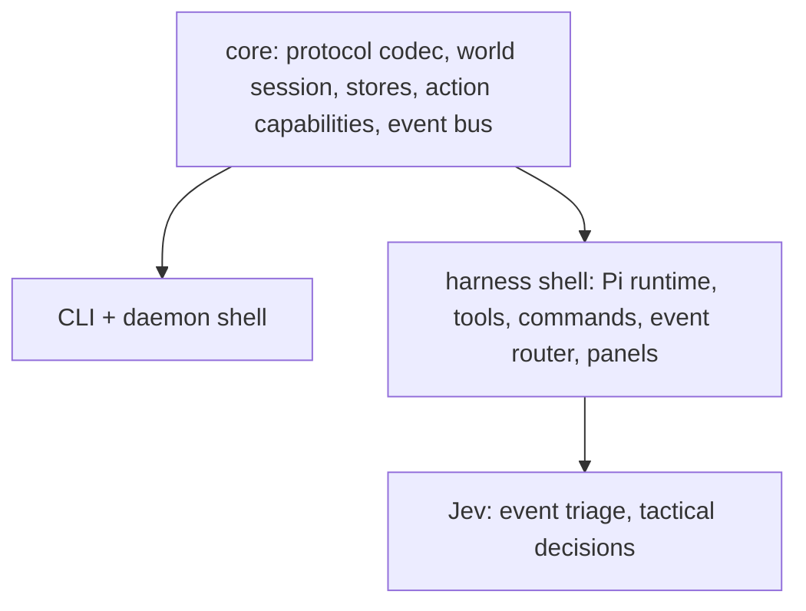

# Pi Harness Design

Spike findings and proposed direction, 2026-09-25. This is a design input
for a future epic. It is not approved roadmap work, and it does not change
[docs/roadmap.md](../roadmap.md).

## Problem

tuicraft exposes its capabilities to agents as a CLI over a stateful
daemon. An agent drives the game one verb at a time: run `nearby`, read the
output, decide, run the next verb. It learns about the world only when it
asks, it cannot observe while it acts, and running verbs concurrently does
not work well. The interface turns a continuous game into isolated
request/response turns.

## Idea

Build tuicraft as an agentic harness instead of only a CLI. The agent loop
lives in the same process as the world state:

- Tools are in-process function calls over the live session, so parallel
  tool calls are ordinary.
- Game events (whispers, invites, damage, procedure completion) are pushed
  into the agent loop instead of polled.
- The harness renders live game state for the human, so the human watches
  and steers the same session the agent drives. This is where the Dwarf
  Fortress-style view from
  [2026-02-20-tui-vision-design.md](2026-02-20-tui-vision-design.md)
  lives.

The CLI does not go away. Both become shells over one shared core (see
[Architecture](#architecture)).

Control is layered by cadence, matching the roadmap's runtime boundaries:
the LLM agent sets objectives and handles conversation (seconds per turn),
Jev makes tactical decisions and filters events (1–5 Hz), and code handles
movement, packets and reflexes. The LLM is never in the fast loop.

## Spike question

Is Pi, or its fork omp, a good primitive for this harness? Specifically:
can it host tuicraft's Bun-only world session in-process, give the agent
real tools, push game events into the conversation, let the human chat in
game, and render a live spatial panel?

Measuring whether an agent plays better in a harness than through the CLI
was out of scope; it needs a proper eval.

## What was built

Two throwaway prototypes, one per base, both in gitignored `tmp/` and not
committed. Each implemented the same probe:

1. Boot the agent TUI.
2. `/connect` logs into WoW in-process via `authWithRetry` and
   `worldSession`.
3. The human chats in game via `/say`, `/w <name> <msg>`, `/g`, `/p`.
4. Incoming chat and events appear in the transcript without waking the
   agent.
5. The agent has tools over `WorldHandle` (`wow_status`, `wow_nearby`,
   `wow_say`, `wow_whisper`, plus `wow_face`/`wow_party` on Pi) and a
   strong model uses them in a real turn.
6. A widget above the editor shows a status line and an entity-only
   top-down ASCII map (player at centre, entities from
   `getNearbyEntities`), redrawn on entity events. A side-by-side variant
   puts the map next to a legend or recent chat.

| | Stock Pi | omp |
|---|---|---|
| Package | `@earendil-works/pi-coding-agent` 0.87.1 | `@oh-my-pi/pi-coding-agent` 18.3.1 |
| Location | `tmp/spike-pi/` | `tmp/spike-omp/` |
| Character | Xia (test account 1) | Yia (test account 2) |
| Model used | `openai-codex/gpt-6-sol`, `anthropic/claude-opus-5` | `anthropic/claude-opus-5-5` |
| Embedding | SDK: `createAgentSessionRuntime` + `new InteractiveMode(runtime).run()` | Deep import: `runRootCommand(parsed, argv, deps)` with injected session factory |
| Throwaway code | about 550 lines | similar |

Both passed all six probe items live against t1. Observed highlights:

- Login from inside the harness took about 7 seconds. The map showed
  Magistrix Erona, Sunstrider Guardians, mana wyrms and the other
  character around `@` on Sunstrider Isle.
- Asked to check status, find the nearest NPC and greet it, both agents
  called `wow_status`, `wow_nearby` and `wow_say`, and the server echoed
  `[say] Xia: Greetings, Magistrix Erona!` back into the transcript.
- A chat line pushed passively earlier was later quoted by the model
  without a tool call, proving passive events reach its context.
- With whisper-wake enabled, an incoming whisper started a turn on its own
  and the agent answered it.
- Human slash commands typed mid-turn ran immediately; plain text typed
  mid-turn was delivered as a steer after the current tool call.
- The two harnesses saw each other's chat in real time.

## Findings

### Runtime

tuicraft is Bun-only (`Bun.connect` in `src/wow/client.ts` and
`src/wow/auth.ts`, `Bun.file` in `src/lib/config.ts`, `bun:ffi` in
`src/wow/navigation-native.ts`). Extensions run inside the harness
process, so the harness must run on Bun.

- Stock Pi's npm package declares Node, but its SDK and `InteractiveMode`
  run under Bun 1.4.2 without issue. The standalone `pi` binary is itself
  Bun-compiled.
- omp is Bun-only and runs tuicraft code in-process.
- tuicraft's bare-path imports (`wow/...`, `lib/...`) resolve through the
  root tsconfig when Bun runs from the repo root. The compiled `omp` binary
  loading a `.ts` extension with `-e` does not apply tsconfig paths and
  fails with `Cannot find package 'wow'`; pre-bundling fixes it. Embedding
  via the SDK avoids the problem entirely.

The existing seam is clean. `src/main.ts` already does
`authWithRetry → worldSession → startTui(handle)`; the harness replaces
`startTui` with the agent runtime. `src/wow` and `src/lib` import nothing
from `src/daemon`, `src/ui` or `src/cli`.

### Extension API

Stock Pi and omp share the same extension shape:

- `pi.registerTool` (TypeBox parameters; tool calls in one assistant
  message may run in parallel).
- `pi.registerCommand` for human slash commands.
- `pi.on("session_start" | "session_shutdown" | "user_bash" | ...)` for
  lifecycle. Sockets open from `/connect` or `session_start`, never in the
  extension factory, and close in `session_shutdown`.
- `pi.sendMessage(msg, { triggerTurn, deliverAs })` for pushing events.
- `pi.registerMessageRenderer` to render `wow-*` messages as one line each
  instead of the default boxed card.
- `ctx.ui.setWidget(key, (tui, theme) => Component, { placement })`,
  `tui.requestRender()`, `ctx.ui.setStatus`, `ctx.ui.custom` overlays.

omp adds `aside` delivery, managed timers and `ctx.runEphemeralTurn`
(side questions without touching history). omp's `setHeader` and
`setFooter` are no-ops.

### Pushing game events

- `triggerTurn: false` appends to the transcript and the next turn's
  context without waking the agent. If the agent is mid-turn, Pi holds the
  message until the turn ends so tool calls and results stay adjacent.
- `triggerTurn: true` wakes the agent when idle. While busy, `steer`
  injects after the current tool batch and `followUp` runs after the
  current run.
- In omp, `steer` and `aside` made the model comment on its own chat
  echoes, wasting tokens. Buffering events and flushing on `agent_end` was
  the cleanest non-waking option.
- Whisper-wake produced a feedback loop when a character whispered itself.
  Real wake rules need sender filtering and a loop guard.
- In the spikes every chat line, including tuicraft's many `[tuicraft] X
  is not yet implemented` system lines, entered the model's context. This
  server runs playerbots, so a busy zone would flood it. The target model
  is described in [Game logs](#game-logs).

### UI

- The widget is a full component and can be swapped live by calling
  `setWidget` again with the same key.
- Stock Pi's `HStack`/`VStack` behave like flexbox and handled a resize
  from 160 to 90 columns cleanly. omp's pi-tui has `Row`, `Stack` and
  `SplitPane` instead; the omp prototype padded lines by hand.
- Rendering is a line-level diff inside synchronized-update escapes. An
  idle connected session wrote about 645 B/s, rewriting only the changed
  status line. No flicker was seen in tmux captures. Pi's `doom-overlay`
  example renders DOOM at 35 fps, so frame rate is not the constraint.
- `render()` runs on every TUI frame, including spinner ticks and each
  streamed token (about 650 calls in a few minutes). A real map must cache
  its lines and rebuild only when dirty.
- Widgets sit only above or below the editor, and take height from the
  transcript. There is no built-in persistent side pane next to the
  transcript; that needs a custom full-screen layout, an overlay, or
  forking `InteractiveMode`.
- The editor always holds keyboard focus. A display-only map is fine; an
  interactive map (pan, inspect, select target) needs `ctx.ui.custom`
  overlays or raw input handling.

### Stripping the coding agent

| Item | Stock Pi | omp |
|---|---|---|
| Built-in tools | `noTools: "builtin"` | `--no-tools`, `enableLsp/enableMCP/enableIrc: false` |
| System prompt | `resourceLoaderOptions.systemPrompt` replaces it; a small `<cwd>` block remains | SDK `systemPrompt` replaces it. The CLI `--system-prompt` route still appends coding-agent directives and the repo's AGENTS.md |
| Context files, skills, templates, extension discovery | `noContextFiles`, `noSkills`, `noPromptTemplates`, `noExtensions` | `--no-skills --no-rules --no-extensions`, `contextFiles: []`, `disabledProviders` in an isolated `config.yml` |
| Session storage, compaction | `SessionManager.inMemory`, `SettingsManager.inMemory` | `--no-session --no-title` |
| `!` shell escape | Intercept `user_bash`; on by default even with no tools | `user_bash`/`user_python` interceptable, not done |
| Built-in slash commands | 35; cannot be removed via the API | About 50; cannot be removed via the API |
| Header/footer chrome | Replaceable via `setHeader`/`setFooter` | Not replaceable |
| Other | fd/rg auto-download, redirectable only via `PI_CODING_AGENT_DIR` set before import | Orchestration features off via `config.yml`; 1.2 GB `node_modules` |

With an Anthropic OAuth credential, the provider transport prepends a
"You are Claude Code" identity block to the system prompt on both bases.

### Credentials

- Neither base needed an interactive login. Both reused credentials the
  machine already had in omp's `~/.omp/agent/agent.db`.
- The Pi prototype copied only short-lived access tokens into an isolated
  Pi `auth.json` and deliberately withheld refresh tokens, because
  refreshing rotates them and would log omp out. It re-syncs at launch and
  fails loudly on expiry (codex about 5 days, Anthropic about 8 hours).
  This is a spike hack, not a design.
- The omp prototype pointed `discoverAuthStorage` at `~/.omp/agent` for
  auth only and kept settings, sessions and models in an isolated agent
  dir.

### Core boundary

`WorldHandle`'s event hooks are single-subscriber setters
(`onMessage(cb) { conn.onMessage = cb }` in `src/wow/client.ts`, and the
same for entity, group, combat and the rest). A second subscriber silently
replaces the first. Both prototypes registered one callback per hook and
fanned out by hand to the transcript, the map and the status line. A
harness with several consumers needs a multi-subscriber event API in the
core.

## Recommendation

Build the harness on **stock Pi, embedded through its SDK under Bun**.

- The public SDK route (`createAgentSessionRuntime`, `InteractiveMode`)
  was sufficient. omp's clean-prompt route depends on `runRootCommand`
  and deep imports into internal entrypoints.
- Stock Pi's stripping was a handful of options. omp's CLI route leaked
  coding-agent directives and AGENTS.md into the prompt, and its
  orchestration stack is baggage a game does not use.
- Stock Pi keeps `setHeader`/`setFooter` and flex layout components.
- omp's last upstream sync from Pi was 2026-03-22, and it diverges on
  purpose. Depending on the fork doubles the tracking risk.
- omp's main advantage, pre-configured providers, is a credentials problem
  that has a smaller answer (below).

Pin the Pi version exactly; it is pre-1.0 and moves quickly. The extension
API shape is shared, so moving between bases later is mostly an import
change.

## Architecture

- **Core.** Everything that talks to WoW and models the world: opcode
  encode/decode, update fields, movement maths, stores, and the world
  session with its socket, ARC4 stream and timers. The codec and reducers
  can be pure; the session is necessarily stateful but has no UI. Today
  this is `src/wow` and `src/lib`, already free of shell imports.
- **CLI shell.** The current daemon, IPC and verbs, unchanged in role.
  Other agents and scripts keep driving tuicraft this way.
- **Harness shell.** Owns a world session in-process and never shells out
  to the CLI or daemon. It contributes Pi tools and commands over the core,
  game logs the agent can query, a promotion path that pushes selected log
  entries into the agent's context, and panels rendering world state for
  the human.

A monorepo (for example `packages/core`, `packages/cli`,
`packages/harness` as Bun workspaces) is the likely end state but is not a
prerequisite. The harness can start as `src/harness/` beside the existing
shells, with the package split done once the core boundary is proven.

Adding Pi makes it tuicraft's first runtime dependency, and a large one.
The 2026-02-20 TUI vision assumed zero runtime dependencies and a
hand-built ANSI renderer; this design deliberately trades that for Pi's
renderer and agent loop.

### Game logs

Chat and game events flow into buffered logs, not into the agent's
context. A log is available to the agent the way a file is: it can read or
search the whole content with tools when it wants to, much like tailing or
grepping any other log. Nothing about chat is special compared with other
logs.

Some entries are promoted into the agent's context directly, either as a
passive message or as one that wakes the agent. Promotion is the exception.
Which entries qualify is not decided; one candidate is running Jev over
each line and promoting the important ones. Simple rules (a whisper
addressed to the character) are another.

The human sees the logs in panels regardless of what the agent sees.

## Proposed milestones

Candidate slices for the epic, in dependency order. Each should be
verified live on the server.

1. **Core event bus.** Replace single-subscriber `on*` setters with
   multi-subscriber subscriptions. Migrate the daemon and TUI callers.
   No protocol change; `mise test:live` guards it.
2. **Harness skeleton.** `src/harness/` entrypoint embedding a pinned Pi
   through the SDK: isolated agent dir, in-memory settings, game system
   prompt, built-in tools, context files and skills off, `!` escape
   blocked, game footer/header. `/connect` and `/disconnect` using the
   normal tuicraft config and character selection. Chat commands, one-line
   message renderers, clean shutdown.
3. **Credentials.** Pick one owner: the user runs Pi `/login` once into
   the harness's agent dir, or the harness reads another store read-only.
   No shared refresh tokens.
4. **Tool surface.** Tools over the core matching the CLI verbs: movement,
   walk, face, target, cast, attack, quests, loot, recovery, tactics and
   cycles. Long-running actions return promptly and are observable and
   cancellable via abort signals; tools sharing mutable state run
   sequentially.
5. **Game logs.** Buffered chat and event logs with agent tools to read
   and search them, and a promotion path into the agent's context
   (passive or waking) with loop guards. Promotion starts with simple
   rules; Jev over each line is a candidate classifier. Entity churn is
   summarised rather than logged per event.
6. **Spatial panel.** Cached, dirty-flagged map component; hostility
   colouring from `FactionTemplateCatalog`; target and status panes; an
   interactive overlay for panning and inspection. Terrain via namigator
   later, per the 2026-02-20 vision.
7. **Jev tactical loop.** Host the roadmap's Jev tactical loop inside the
   harness, with the LLM agent supervising objectives.

## Open questions

- Whether to fork `InteractiveMode` (or build a custom full-screen layout)
  to get a persistent side panel and drop the coding-agent slash commands,
  or live with widgets and overlays.
- Where the core/shell package split happens and when.
- How the harness selects account and character: the shared tuicraft
  config, a harness-specific profile, or both.
- Whether the harness should expose its session to other agents (for
  example via Pi's RPC mode), recovering the "any agent can drive it"
  property the CLI has.
- How to evaluate whether harness play is actually better than CLI play,
  if that ever matters.
