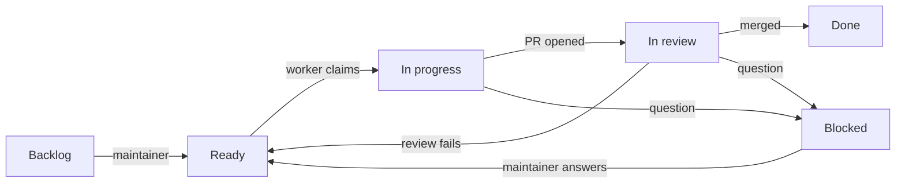

# Project Board Design

Date: 2026-09-26. Issue #273; the factory change is #103. Status: design
only, board already set up. It replaces the factory's workflow labels with
the Status field of one GitHub Projects board, and folds in the
reaper-state design (reaper holds become board cards, not issues).

## Goal

The maintainer starts work by dragging a card, sees everything that waits
on them in one place, and the factory keeps its state on the board. Start
from the leanest setup that works and add features only when a real need
shows up. OpenAI Symphony is the reference: a small status machine on the
tracker, a poller per role, one workpad comment per issue
([research](2026-09-25-dev-factory-research.md), §2.2).

## Board

Project [tvararu/1](https://github.com/users/tvararu/projects/1)
(`PVT_kwHOABkwu84BktxO`), user-owned, public, linked to the repo. It was
created from the "Iterative development" template and reshaped to plain
Kanban: the iteration views and the Priority, Size, Estimate and Iteration
fields are gone. The only custom field is Status.

| Status | Moved there by | Meaning |
|---|---|---|
| Backlog | new issues land here | Filed, not started |
| Blocked | any agent | Waits on the maintainer; a comment says what is needed |
| Ready | the maintainer only | Work on this; oldest first |
| In progress | worker, on claim | A worker owns it |
| In review | worker, on opening the PR | Reviewer, then merger |
| Done | GitHub workflows, on merge or close | Landed or closed |

Views:

- **Board** (board layout, columns by Status): the web surface for
  dragging. Orca greys board views out.
- **Queue** (table grouped by Status): Orca's stand-in for the board.
  Orca renders tables with the view's grouping, sort and filter, edits
  Status inline per cell, has no drag between groups, and writes through
  the maintainer's own `gh` login (checked 2026-09-26: an Orca edit cost
  OpenHubris no GraphQL quota). Setting a cell to Ready in Orca is the
  same release step as dragging on the web. The Blocked group is the
  maintainer's inbox.

The API cannot set a view's grouping (`ProjectV2ViewConfigurationInput`
only has `visibleFieldIds`), so Queue's "Group by: Status" is set in the
web UI.

Built-in project workflows: Item added (sets Backlog), Item closed and
Pull request merged (set Done), Auto-close issue, Auto-add sub-issues.
"Auto-add to project" (`is:issue` in `tvararu/tuicraft`) puts every new
issue in Backlog, so agents never add cards themselves. "Pull request
linked to issue" is off: the worker sets In review itself.

## Starting work, and the trust gate

The maintainer drags a card to Ready. That is the whole release step; no
label is needed.

GitHub does not record who changes a Status on a user-owned project. A
drag by the maintainer on the web and a move by OpenHubris through the API
both leave no timeline event, and the value's `creator` keeps the first
setter (checked on #103, 2026-09-25 and 2026-09-26). Org projects have
`projects_v2_item` webhooks, but moving to an org and running a webhook
receiver is not worth it for one maintainer.

So OpenHubris keeps write access, and the gate is a rule, not a check:
**no agent moves a card to Ready unless it already has an open factory
PR** (rework, below). Every prompt says so. The factory's caps (3
attempts per issue, runs in flight, run time) bound the damage of a rule
break. If agents ever self-dispatch in practice, the fallback is an
org-owned project with actor-bearing webhooks.

## Flow

- **Worker** picks the oldest Ready card with no open blocked-by issue and
  no live claim, moves it to In progress, and posts its claim comment as
  today. It opens the PR and moves the card to In review. If it needs the
  maintainer, or hits its third attempt, it comments the question and
  moves the card to Blocked.
- **Reviewer** takes In review cards whose PR head lacks `factory/review`.
  A failing review comments why and moves the card back to Ready, which
  the worker treats as rework because a PR already exists. A product
  question moves it to Blocked.
- **Merger** lands In review cards whose PR head has green `signoff/ci`,
  `factory/ci` and `factory/review`; no separate Merging state is needed,
  because the statuses already say it. A conflict or failed `mise ci`
  after rebase sends the card back to Ready with a comment. On merge,
  GitHub sets Done.
- **QA** files issues; auto-add puts them in Backlog for triage.
- The per-run locks `agent:working`, `agent:reviewing` and `agent:landing`
  are dropped. The existing claim comments (`factory:claim`,
  `factory:landing`) already decide races and stay as they are.

Blocked means blocked on the maintainer. An issue that waits on another
issue uses GitHub's blocked-by link and stays where it is; the factory
skips it until the blocker closes.

No agent @-mentions anyone. The maintainer does not use GitHub
notifications; the Blocked group is where they look. Every move to
Blocked comes with a comment on the issue that says what the problem is
and what the maintainer needs to do.

## Reaper holds

A hold is a worktree the reaper will not remove (dirty, unlanded commits)
or a stray `core.worktree` in the main checkout. Today each hold files a
`Reaper: … held` issue with `needs:pm`; the only four ever filed were a
probe and three false holds from #251, which squash-aware `landed()` fixed.

Instead, the reaper keeps one draft card per hold in Blocked, titled
`Reaper: <worktree> held (<reason>)`. Its body is today's report body
without the @-mention: owner, reason, archive path, the linked issue if
the branch names one, and what to do. The reaper updates the draft when
the hold changes and deletes it once the hold clears. Draft cards are not
repo issues, so the tracker stays clean, and they sit in the same inbox as
every other thing that needs the maintainer.

## Labels

Before: 9 unused GitHub defaults, 2 release-please labels, and 10 factory
labels. The defaults and `autorelease:*` were deleted on 2026-09-26. After
#103 lands, no labels remain:

| Label | Replaced by |
|---|---|
| `ready` | Status Ready |
| `agent:working` | Status In progress |
| `agent:review` | Status In review |
| `agent:reviewing` | reviewer claim comment |
| `agent:rework` | Status Ready with an open PR |
| `agent:merging` | In review with green `factory/*` statuses |
| `agent:landing` | merger `factory:landing` comment |
| `needs:pm` | Status Blocked |
| `qa:found` | issue author OpenHubris and Backlog |
| `p1` | nothing; oldest first |

Non-factory work (a coordinator's own PR) goes through the same reviewer
and merger by putting its issue's card in In review.

## Later ideas, not built

- **Sizes.** Two sizes, small and normal. A small card could go to a
  cheaper implementing model while review stays on the normal one. Needs
  thought about who sizes cards and what "small" allows.
- **Urgent.** A second Ready column, Urgent, picked before Ready and
  possibly with its own workflow, instead of a Priority field the
  maintainer would have to set on every card.
- **One agent per issue.** Symphony has one agent carry an issue from
  Todo to landing. Worth trying only if the handoffs between our roles
  turn out to be the problem.
