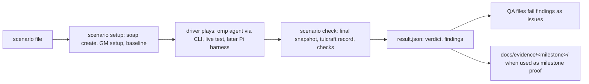

# Live scenario catalogue and runner: design

Date: 2026-09-26. Status: design, not started. Issue: [#196].

## Problem

The overnight run on 2026-09-25/26 played the game four different ways:
a 64-minute grind playtest, a questing playtest on Sunstrider Isle, a duo
playtest in Eversong Woods, and the M3a, M5 and M6 evidence runs. Each one
built its own loop from scratch: its own CLI wrappers around the `XDG_*`
variables that `soap create` prints, its own journal format and its own
idea of success. They found real defects ([#165], [#166], [#167], [#169],
[#178], [#179], [#182], [#183], [#185]), but none of them can be run again
the same way, their results cannot be compared, and a regression on `main`
is found only if someone happens to play that path again.

The roadmap already asks for this ("Define concrete scenarios and
acceptance criteria before starting an increment, then preserve useful
scenarios as capabilities grow"), and milestone 1 opens with "Establish
repeatable live scenarios". This document proposes a catalogue of such
scenarios and a small runner that the factory QA role can use to replay a
rotating subset on each new `main`.

## Principles

These come from the roadmap's exit-evidence rules and from what went
wrong in tonight's runs.

- **Success is server-confirmed state.** A scenario passes on observed
  state and server packets, never on a CLI `OK` or a `kind: "intent"`
  envelope. Quest progress is a quest-log counter or item push, a reward
  is a coinage, item or XP change, a position is a relogin pose, a kill is
  `server_kill_credit`. This is the M5 rule ("distinguish acceptance,
  objective progress, completion, reward notification and actual
  inventory/experience changes") applied to every scenario.
- **GM commands only during setup.** A scenario may use GM commands (for
  example `.go xyz`, `.die`) to reach its start state before the baseline
  is taken. After the baseline, a GM command, a daemon restart or any
  other hidden repair fails the scenario unless the scenario is about that
  repair. M4 and M6 both require play "without developer repairs".
- **Throwaway characters only.** Every run creates its characters with
  `soap create` and deletes them afterwards. One agent owns each
  character's CLI for the whole run.
- **Four verdicts, not two.** `pass`, `fail` (a check unmet or a new
  failure signal), `blocked` (a check unmet because of an open issue the
  scenario already names) and `aborted` (infrastructure: server down, SOAP
  unreachable, no Jev key). Only `fail` produces a new issue. `aborted` is
  never a product finding.
- **Report attempts, not only successes.** A run keeps its counts of
  blocked targets, stops, deaths and interventions even when it passes,
  as M6 requires.

## Catalogue

Fifteen scenarios. Presets are the three `soap create` templates: `fresh`
(level 1 blood elf priest at the Sunstrider Isle start, map 530),
`eversong10` (level 10 blood elf priest in the Fairbreeze Village inn, map
530, with 5 gold, food and potions) and `max80` (level 80, Dalaran).
Coordinates are taken from tonight's journals and evidence. "Blocked by"
is the issue state on 2026-09-26 at 02:30 UTC. Most of those issues have a
PR in review, and the scenario file's `blocked_by` list stays the source
of truth after this date.

| # | Id | Preset | Duration | Serves | Driver | Hard blockers today |
|---|---|---|---|---|---|---|
| 1 | `quest-first` | fresh | 5–25 min | M5 | live test + agent | [#116] |
| 2 | `quest-to-level-3` | fresh | 45–75 min | M5, M6 | agent | [#116], [#146] |
| 3 | `grind-30` | eversong10 | 35 min | M4, M6 | agent | [#165], [#166] |
| 4 | `mana-downtime` | eversong10 | 20 min | M4, M6 | agent | [#169] |
| 5 | `neutral-pull` | eversong10 | 5 min | M4 | agent | [#135] |
| 6 | `corpse-run` | eversong10 (GM 2) | 5 min | M4 | live test | none |
| 7 | `death-in-cycle` | eversong10 | 15 min | M4, M6 | agent | [#131] |
| 8 | `travel-places` | eversong10 | 10–15 min | M3a | live test + agent | [#120], [#162], [#151] |
| 9 | `route-redirect` | eversong10 | 5 min | M3a | live test | [#124], [#130] |
| 10 | `halt-resume` | eversong10 | 5 min | M6 | agent | [#129] |
| 11 | `manual-takeover` | eversong10 | 5 min | M1, M6 | agent | none |
| 12 | `ambush-at-rest` | eversong10 | 10 min | M6 | agent | [#183] |
| 13 | `duo-grind` | 2 × eversong10 | 25 min | M3b, M6 | agent | [#125] |
| 14 | `vendor-loop` | eversong10 | 15 min | M5, M6 | agent | no capability |
| 15 | `soak-60` | eversong10 | 60 min | M6 | agent | most of the above |

Each entry below gives the start, the goal, the success criteria and the
failure signals. "Known friction" lists open issues that slow a scenario
down without making it impossible; a matching signal is recorded as
known, not filed again.

### 1. `quest-first`: the first quest, end to end

- **Preset and start.** `fresh`, Sunstrider Isle start
  (10349.6, -6357.3, 33.4). Magistrix Erona (entry 15278) stands nearby.
- **Goal.** Take quest 8325 "Reclaiming Sunstrider Isle", kill 8 Mana
  Wyrms (15274), return and turn it in.
- **Success.** QUEST `accepted` (source `quest_log`) with slot counters
  `[0,0,0,0]`; eight QUEST `progress` events with counters rising 1 to 8;
  QUEST `completed` (slot flags 1); QUEST `rewarded` (packet); then, from
  snapshots, coinage +30, one of items 20997 or 20998 new in the bags, and
  `experience` XP +100 over the pre-turn-in value. Level 2 is reached on
  the way.
- **Failure signals.** `unverified_hostile_relation` on a wyrm,
  `target_stale` from `face-guid`, `cast_failed` with result 47 (line of
  sight), `goto` refusals `pick_destination` or `UNKNOWN_HEIGHT`, `move`
  legs of 0 yd, `quest_already_in_log` handled as an error rather than as
  an auto-accept.
- **Duration.** About 4 minutes on the M5 route with known waypoints; 25
  minutes or more for a new player (the questing playtest took 5 minutes
  for its first two kills).
- **Serves.** M5 exit evidence: accept, travel, objectives, return,
  turn-in, with Jev in every fight.
- **Blocked by.** [#116] (the dialog path and the `experience` verb, PR
  #134). Known friction: [#135], [#136], [#138], [#151], [#162], [#182].
- **Evidence so far.** `docs/evidence/m5/` on PR #134 and PR #153;
  `src/test/live-quest.ts` on PR #134 covers the dialog half.

### 2. `quest-to-level-3`: a new character to level 3 by questing

- **Preset and start.** `fresh`, Sunstrider Isle start.
- **Goal.** Take and finish whatever quests the island's givers offer
  (8325, 8326, 8327, the class quest 8564 and others), with no grinding
  beyond quest objectives, until level 3.
- **Success.** `experience --json` level ≥ 3 at the end; at least three
  QUEST `rewarded` events, each matched by its own coinage, item and XP
  change in snapshots taken around the turn-in; no GM command and no
  daemon restart after the baseline.
- **Failure signals.** As scenario 1, plus collect progress that does not
  match the bag stack (M5 found that the server sends item pushes, not
  quest-update packets, for collect quests), a follow-up auto-accept quest
  that enters the log already complete and is never turned in, and a
  quest whose giver cannot be found from `nearby`.
- **Duration.** 45–75 minutes.
- **Serves.** M5 (more than one quest, collect as well as kill) and M6
  (a long session with changing objectives).
- **Blocked by.** [#116], [#146] (collect correlation, PR #153). Known
  friction: [#135], [#136], [#138], [#151], [#162], [#168], [#170],
  [#182].

### 3. `grind-30`: a 30-minute grind

- **Preset and start.** `eversong10`, Fairbreeze Village inn
  (8714.14, -6650.33, 72.75). Springpaw Stalkers and Dragonhawks are
  north of the village (around 8765, -6556); undead are at the Dead Scar
  edge (around 8249, -6750).
- **Goal.** Grind and loot for 30 minutes of play, choosing targets from
  `nearby`, fighting with `fight` or `cycle`, looting every kill that
  offers loot, resting as needed.
- **Success.** From `tuicraft record` over the window:
  `completions.serverKillCredit` ≥ 15 and every fight ending with a named
  status. From snapshots: XP gained ≥ the sum of COMBAT `xp` kill events;
  every loot window opened is closed by the end (`loot --json` closed);
  inventory item or coinage gains for at least half the kills that
  offered loot; `recovery` life `alive` at the end; the daemon process
  unchanged.
- **Failure signals.** Loot stuck in `opening` for more than 60 s or
  `Previous loot window has not closed` ([#165]); a fight that ends
  `jev_timeout` with the target still attacking ([#166]); a fight that
  runs longer than 120 s with no damage dealt ([#179]); death outside a
  fight ([#183]); a `PACKET` `packet_error` in the session log (for
  example [#185]).
- **Duration.** 30 minutes of play plus about 5 of setup. The playtest
  managed 63 kills in 64 minutes, with half the time spent resting.
- **Serves.** M4 (sequences of encounters with loot, recovery or a
  concrete blocking condition) and M6.
- **Blocked by.** [#165], [#166]. Known friction: [#154], [#167],
  [#169], [#170], [#179], [#182], [#183].
- **Evidence so far.** The grind playtest journal (not committed) and
  `docs/evidence/m4/`.

### 4. `mana-downtime`: managing mana between fights

- **Preset and start.** `eversong10`, then travel to the Dead Scar edge
  (around 8249, -6750), where the playtest priest emptied its mana on
  nearly every level 9–10 undead.
- **Goal.** Ten kills in a row, recovering mana and health between fights
  by eating and drinking the carried food and drink rather than standing
  idle.
- **Success.** Ten `server_kill_credit` outcomes; at least one Food or
  Drink aura observed after `use-item`, with the stack count falling by
  one each time; mana at each pull ≥ 50% of maximum (from the fight's
  first tactics observation); no death; resting time (the window minus
  the record's active tactics time) under 40% of the run.
- **Failure signals.** A pull below 30% mana; `use-item` refused out of
  combat; food used in combat (the server refuses it with inventory result
  60); death.
- **Duration.** About 20 minutes.
- **Serves.** M4 (resource handling "as those scenarios need them") and
  M6.
- **Blocked by.** [#169] (`use-item`, PR #184). Known friction: [#166],
  [#183].

### 5. `neutral-pull`: neutral creatures

- **Preset and start.** `eversong10`, north of Fairbreeze. Crazed
  Dragonhawks and Feral Dragonhawk Hatchlings use faction template 7,
  which is neutral to the player.
- **Goal.** Kill three neutral creatures with `cycle` and `fight` alone,
  without a manual pull.
- **Success.** Three `server_kill_credit` outcomes on creatures whose
  faction template is neutral; no `unverified_hostile_relation` skip in
  the record; no `cast` or `attack` issued by the driver.
- **Failure signals.** `unverified_hostile_relation` from `fight` or
  `cycle`; a driver-issued Smite pull.
- **Duration.** About 5 minutes.
- **Serves.** M4 (varied enemies).
- **Blocked by.** [#135] (PR #139).

### 6. `corpse-run`: death and corpse run

- **Preset and start.** `eversong10` with `--gm 2`, teleported during
  setup to the Stalker field north of Fairbreeze and killed with `.die`
  before the baseline, so the run starts dead.
- **Goal.** Release, run back as a ghost and reclaim the corpse using only
  the documented recovery verbs and bounded `face`/`move` legs.
- **Success.** RECOVERY events in order: ghost flags observed after
  `release-spirit`; `query-corpse` answered with a corpse position;
  `reclaim-corpse` followed by life `alive` observed from player flags and
  health above zero; the final pose within 40 yd of the corpse; no spirit
  healer, no GM command after the baseline and no daemon restart.
- **Failure signals.** `rooted` refusals while a ghost; `move` legs of 0 yd
  ([#182]); a spirit-healer request that is never answered ([#178]);
  reclaim refused for distance.
- **Duration.** About 3–5 minutes.
- **Serves.** M4 (death and recovery without developer repair).
- **Blocked by.** Nothing: the recovery verbs are on `main` and M4 proved
  two cycles. Known friction: [#178], [#182].

### 7. `death-in-cycle`: a natural death inside a cycle

- **Preset and start.** `eversong10`, then travel to the Dead Scar edge.
- **Goal.** Run `cycle` over a queue of level 9–10 undead chosen so the
  character is likely to die (no rest between targets), and let the cycle
  recover and continue. The M6 session never produced this: all its five
  deaths happened between cycles.
- **Success.** In one cycle run: a RECOVERY death, release, corpse legs,
  reclaim, then a later target in the same queue ending
  `server_kill_credit`. The record shows `recoveries.recovered` ≥ 1 with
  no intervention between the death and the kill.
- **Failure signals.** Cycle stop `corpse_unreachable`; any intervention
  between the death and the next kill; a spirit-healer fallback.
- **Duration.** 10–15 minutes, because the death is not forced.
- **Serves.** M4 and the M6 gap "a death inside a running cycle followed
  by in-run recovery" (M6 README on PR #175).
- **Blocked by.** [#131] (PR #148). Known friction: [#178], [#182].

### 8. `travel-places`: travel between named places

- **Preset and start.** `eversong10`, just outside the Fairbreeze inn
  (8723.14, -6665.85, 70.26), because `goto` refuses to start inside the
  inn's multi-floor column.
- **Goal.** Walk a fixed tour with `goto` only: Fairbreeze east
  (8764.71, -6683.07), the Stalker field (around 8765, -6556), the Dead
  Scar edge (around 8249, -6750) and back to the Fairbreeze graveyard
  (around 8709, -6671). The names map to coordinates in a places file (see
  [Scenario files](#scenario-files)); understanding place names is not the
  point, and the roadmap does not require it.
- **Success.** Each leg ends with `navigation --json` inactive, remaining
  0 and no `blockedReason`; after the last leg, `stop` and `start` give a
  server login pose within 2 yd of the destination; no `move`, `face` or
  `walk-toward` issued by the driver.
- **Failure signals.** Refusals `pick_destination`, `UNKNOWN_HEIGHT`,
  `ambiguous ground column`, `height_unresolved`, `target_unreachable`;
  a leg over its time budget.
- **Duration.** 10–15 minutes.
- **Serves.** M3a (repeatedly traverse known routes, confirm positions
  from observed state).
- **Blocked by.** [#120] (PR #122), [#162] (PR #172), [#151] (patched
  namigator, waiting on Theo). Without #151 about 1150 of 1681 grid
  destinations near Fairbreeze refuse. Known friction: [#138], [#182].

### 9. `route-redirect`: repeat, redirect, stop and give up

- **Preset and start.** `eversong10`, outside the Fairbreeze inn.
- **Goal.** Walk a known 56 yd route three times; redirect mid-route to a
  second destination; `halt` mid-route; ask for an unreachable
  destination; follow a target that despawns.
- **Success.** Three arrivals at the same point (relogin pose within
  2 yd); the redirected route stops as `replaced` and the new one arrives;
  `halt` leaves the character stationary with no further movement events;
  the unreachable request ends `target_unreachable` and the despawned one
  `target_lost`, each without retries.
- **Failure signals.** Movement after `halt`; a route that retries without
  a limit; an arrival reported without a matching pose.
- **Duration.** About 5 minutes.
- **Serves.** M3a (stop or change course cleanly, report unreachable
  destinations or lost targets).
- **Blocked by.** [#124] (PR #128), [#130] (PR #144). Evidence so far:
  `docs/evidence/m3a/` on those PRs.

### 10. `halt-resume`: HALT and a new instruction mid-fight

- **Preset and start.** `eversong10`, north of Fairbreeze.
- **Goal.** Start a `cycle` over three Stalkers; during the first fight,
  `halt`; then `cycle --resume` with a different instruction.
- **Success.** In the record: interventions `halt`, `resume` and
  `instruction_change`, in that order; the halted target later ends
  `server_kill_credit` under the new instruction; the queue order and the
  loot state of targets already done are kept.
- **Failure signals.** `cycle_nothing_to_resume` after a halt; a Jev
  action applied after the halt (the record's stale discards should
  absorb late results); the halted target skipped.
- **Duration.** About 5 minutes.
- **Serves.** M6 (change objectives, intervene and resume).
- **Blocked by.** [#129] (PR #143). Evidence so far: three HALT and
  resume pairs in the M6 session on PR #175.

### 11. `manual-takeover`: manual control wins

- **Preset and start.** `eversong10`, north of Fairbreeze.
- **Goal.** While a `fight` runs, take over with `move` and `face`; later,
  while a `cycle` runs, start a new `cycle`.
- **Success.** The fight stops with a manual-override cause and no Jev
  action is applied after the takeover; `control --json` shows manual
  ownership; the replaced cycle stops `manual_override` (record
  intervention) and the new one runs.
- **Failure signals.** A Jev movement or cast applied after the manual
  command; ownership left with tactics; a stale owner's cleanup stopping
  the newer owner.
- **Duration.** About 5 minutes.
- **Serves.** M1 (who owns control and how an external stop overrides it)
  and M6.
- **Blocked by.** Nothing known.

### 12. `ambush-at-rest`: attacked while idle

- **Preset and start.** `eversong10`, at the Wretched camp near Sunsail
  Anchorage (around 8780, -6200), where the M6 session died while
  resting.
- **Goal.** Arm self-defence (`defend on`), then stand and rest near the
  camp until a creature attacks.
- **Success.** `defense --json` shows an active attacker and the defence
  ends with `server_kill_credit`; the character is alive at the end;
  `halt` afterwards disarms defence.
- **Failure signals.** Death with defence armed; defence engaging a
  creature that did not attack; defence continuing after `halt`.
- **Duration.** About 10 minutes, depending on respawns.
- **Serves.** M6 (respond to trouble without developer repair). All five
  M6 deaths happened this way.
- **Blocked by.** [#183] (PR #190).

### 13. `duo-grind`: two characters in a party

- **Preset and start.** Two `eversong10` characters, A and B, both at the
  Fairbreeze inn. One driver owns both CLIs.
- **Goal.** A invites B by exact name (`tuicraft /invite <name>`), B
  accepts; they grind the Stalker field together for 20 minutes; B's
  `nearby` tracks A while A moves; they leave the group at the end.
- **Success.** GROUP events on both sides (invite received, group list
  with both members); for shared kills, XP events on both characters
  within the same second for the same victim; B's `nearby --json` shows
  A's pose as moving and then stationary with receive times that advance;
  both alive at the end; the group destroyed after `/leave`.
- **Failure signals.** The unexplained 30-second party timeout from M1;
  A's pose on B frozen while A moves; loot refused for one member.
- **Duration.** About 25 minutes.
- **Serves.** M3b (remote movement reception, before any follow claim)
  and M6.
- **Blocked by.** [#125] (PR #127, in rework). Follow itself has no
  command since `05ee035`; a follow step can join this scenario once 3b
  delivers it. The duo playtest was still running when this was written;
  its issues belong in this entry's `blocked_by` when filed.

### 14. `vendor-loop`: sell, buy and repair

- **Preset and start.** `eversong10`, Fairbreeze Village.
- **Goal.** After a short grind, walk to a Fairbreeze vendor with repair,
  sell the grey items, buy drink and repair.
- **Success.** Each sold item leaves its bag slot and coinage rises by the
  item's sell price; the bought item appears with coinage falling by its
  price; after repair every equipped item's `durability` equals its
  `maxDurability` in `inventory --json`, with coinage falling.
- **Failure signals.** Sell or buy refused; coinage change that does not
  match the price; durability unchanged after repair.
- **Duration.** About 15 minutes.
- **Serves.** M5 ("inventory and other capabilities required") and M6.
- **Blocked by.** The capability is missing and has no issue yet: no
  vendor list, sell, buy or repair verbs (`SMSG_LIST_INVENTORY` is a
  stub), although item durability is already observed. Known friction:
  [#136] (`walk-toward` refused stationary vendors), [#170]. This entry
  stays in the catalogue so the gap is visible; it is not runnable.

### 15. `soak-60`: a varied supervised hour

- **Preset and start.** `eversong10`, Fairbreeze Village.
- **Goal.** One hour mixing the scenarios above: a grind in two areas
  with different creature types, travel between them, at least two
  instruction changes, one HALT and resume, one manual takeover, and
  whatever deaths happen naturally.
- **Success.** The M6 exit list, from the record and the journal: kills
  across at least two creature types and two areas; every cycle stop has
  a named cause; at least one HALT and resume ending in a kill; every
  death recovered without a repair; stale discards and latency reported;
  each failure reconstructable from the session log.
- **Failure signals.** Any repair (daemon restart, GM command); a death
  not recovered; a run with no progress for more than 120 s; the signals
  of scenarios 3, 7 and 12.
- **Duration.** 60 minutes plus setup.
- **Serves.** M6 exit evidence ("varied sessions across enemies, routes,
  abilities, and interruptions, without developer repairs").
- **Blocked by.** Most blockers above, in particular [#131], [#166],
  [#179], [#182], [#183]. The 41-minute session on PR #175 is its first
  attempt.

## Runner

The runner is deliberately small. It sets up characters, takes snapshots
before and after, checks the results, and writes one JSON file per run.
The driver plays the game, and the runner does not script any play.



### Scenario files

One TOML file per scenario in `docs/scenarios/<id>.toml`. TOML because
mise and the tuicraft config already use it, and Bun imports it with no
dependency. The file is data, not a program: there is no step language.
The prose `brief` tells the driver what to do; the `expect` and `signal`
tables tell the checker what to look for.

```toml
id = "grind-30"
title = "A 30-minute grind north of Fairbreeze"
tier = "rotation"            # smoke | rotation | soak
driver = "agent"             # agent | live-test
jev = true                   # setup refuses to start without TYPESAFE_API_KEY
characters = [{ preset = "eversong10" }]
budget_minutes = 40
milestones = ["M4", "M6"]
blocked_by = [165, 166]      # cannot pass while open
known = [154, 167, 169, 170, 179, 182, 183]
touches = ["src/wow/loot*", "src/wow/tactics*", "src/wow/encounter-cycle*"]

[start]
place = "fairbreeze-inn"     # from docs/scenarios/places.toml
setup = []                   # GM commands, allowed only before the baseline

brief = """
Grind creatures north of Fairbreeze for 30 minutes of play. Pick targets
from `nearby --json`, fight only with `fight` or `cycle`, loot every kill
that offers loot, and rest when you need to. No GM commands.
"""

[[expect]]
source = "record"            # tuicraft record --since <baseline>
path = "completions.serverKillCredit"
min = 15

[[expect]]
source = "final"
path = "loot.loot.phase"    # loot --json is the rewards state
equals = "closed"

[[expect]]
source = "final"
path = "recovery.life"
equals = "alive"

[[signal]]
name = "loot stuck opening"
event = { type = "REWARDS", match = { type = "loot_invalidated" } }
issue = 165

[[signal]]
name = "fight abandoned on Jev timeout"
event = { type = "TACTICS", match = { type = "outcome", reason = "jev_timeout" } }
issue = 166
```

The vocabulary stays this small:

- `source` is one of `baseline`, `final`, `delta` (final minus baseline,
  for numbers), `record` (the `tuicraft record` JSON for the window) or
  `events` (session-log lines in the window, with `count` or `sum` over a
  field). Paths are dotted paths into that JSON. For two characters the
  path starts with the character's index (`0.`, `1.`).
- An `expect` asserts `min`, `max` or `equals`. An unmet `expect` makes
  the verdict `blocked` if an issue in `blocked_by` is open, otherwise
  `fail`.
- A `signal` matches session-log lines by their `type` (the upper-case
  domain tag the daemon writes: `REWARDS`, `TACTICS`, `CYCLE`, `QUEST`,
  `RECOVERY`, `COMBAT`, `PACKET`) and a `match` table that must be a
  subset of the line's `data`. A match whose `issue` is open is
  recorded as known; one whose `issue` is closed is a regression; one with
  no `issue` is a new finding. Every scenario also inherits the global
  signals: any `PACKET` `packet_error` line, a GM command after the
  baseline (a whisper to self starting with `.`), and a daemon restart (the
  pidfile's PID changed between snapshots).

`docs/scenarios/places.toml` names coordinates (`fairbreeze-inn`,
`fairbreeze-east`, `stalker-field`, `dead-scar-edge`, `wretched-camp`,
`sunstrider-start` and so on). A place enters that file only with a
server login pose from a relogin at that spot, so every named point is
known to be standable. A place outside the preset's spawn is reached
either by the setup's `.go xyz` (GM) or by travel inside the scenario.

### Snapshots

A snapshot is the `data` of the existing JSON verbs, run in a fixed order
and stored in one object: `control`, `experience`, `inventory`, `loot`,
`quests`, `recovery`, `combat`, `cycling` and, once #183 lands,
`defense`, plus the daemon PID and the session-log time. `baseline` is
taken after setup, and `final` after the driver stops or the budget runs
out. No new daemon verb is needed.

### Who drives

- **Live test.** Deterministic, Jev-free scenarios run as tests in
  `src/test/live-*.ts` under `mise test:live`, with GM setup as the
  current live tests do. The test's `describe` name carries the scenario
  id. These tests do not read the TOML file; the file documents them and
  lets QA find the test by id.
- **Agent through the CLI.** Everything that needs judgement or Jev. The
  driver is an omp agent: the QA agent itself, or the worker agent that
  wants milestone evidence. It reads `scenario brief <id>` (the file's
  brief plus the standing rules below) and plays with CLI verbs, with Jev
  making the in-fight decisions through `fight`, `cycle` and `defend`. It
  keeps a journal of every command with epoch ms and its reason, as the
  M6 supervisor did, because the session log cannot see travel, rests or
  restarts.
- **Pi harness, later.** The harness can drive the same scenarios once it
  exists, because the checker needs only snapshots and a session log. The
  harness shell would have to write the same session-log lines and answer
  the same snapshot queries from core. The core moves in PRs #163 and #164
  (nearby and navigation observation) point that way. This document makes
  no harness change.

The standing rules appended to every brief: CLI verbs only; no GM command
after the baseline; report a daemon restart instead of hiding it; stop at
the budget; filter playerbot chat and invite only the run's own
characters by exact name; check `recovery` before reading a movement
refusal as terrain (the M6 supervisor misread `rooted` for up to 20 s).

### Evidence

The runner writes everything under `tmp/scenarios/<id>/<utc-stamp>/`:

- `scenario.toml`, a copy of the file that was run;
- `baseline.json` and `final.json`;
- `record.json`, the output of `tuicraft record --since <baseline ms>`
  (from #132, PR #149) for each character;
- `session.jsonl`, the session-log lines in the window;
- `journal.md`, the driver's journal;
- `result.json`, which holds the scenario id, the tested SHA, the
  accounts and characters, each `expect` with its observed value, each
  signal match, the verdict and the findings.

That directory is gitignored backing detail, as `docs/evidence/README.md`
already prescribes for raw session-log slices. When a run is milestone
evidence, the agent commits `result.json` as
`docs/evidence/<milestone>/scenario-<id>-<date>.json` with a README
section in the M5 and M6 style (records, setup, what it shows, failures,
not shown). QA never commits.

`tuicraft record` currently summarises only CYCLE, TACTICS and RECOVERY
events. Quests, loot gains, XP and travel are checked from snapshots and
`events` instead. Whether `record` should grow quest and loot sections is
a later decision, to be made once the scenarios show which counts matter.

### QA rotation

The QA role (`src/factory/prompts/qa.md`) already runs on each new `main`
with its own SOAP account, and already builds ad-hoc scenarios from each
landed issue's acceptance criteria. The catalogue gives it a fixed set to
fall back on and to rotate through.

1. `bun $F scenario pick <sha>` reads `tmp/qa-changes.json` and a state
   file, `~/.local/state/tuicraft-factory/scenarios.json`, which holds
   each scenario's last run: SHA, verdict and time. It prints the ids to
   run, in this order:
   - every `smoke` scenario (the current core loop becomes one);
   - **fix proof:** a scenario whose `blocked_by` names an issue closed in
     this range, since the landed change claims to unblock it;
   - **touched:** a scenario whose `touches` globs match a changed file;
   - **rotation:** the least recently run `rotation` scenario whose hard
     blockers are all closed.
   It skips scenarios with an open hard blocker (they would only be
   `blocked`), and caps the non-smoke picks at two so a QA run stays
   under an hour. A `soak` scenario is picked at most once a day, only
   when no other scenario was picked.
2. QA runs each picked scenario with `scenario setup`, drives it, and runs
   `scenario check`, which deletes the SOAP accounts. It never runs two
   scenarios on one character.
3. For each `fail` finding, QA follows its existing duplicate search and
   filing rules, adding `Scenario: <id>` and the `result.json` excerpt to
   the body. A regression of a closed issue is filed as a new issue that
   names the closed one. The prompt must say so explicitly, because the
   current rule skips anything closed in the last 30 days. Known signals
   are not filed.
4. The state file is updated, and the Orca comment lists the verdicts
   (`QA <sha:7>: 2 issues filed; halt-resume pass, grind-30 blocked`).

### What is new, and what is reused

New:

- `docs/scenarios/*.toml` and `docs/scenarios/places.toml`: data only.
- A `scenario` subcommand in the factory CLI (`src/factory/scenario.ts`,
  wired into `src/factory/main.ts`) with `list`, `brief`, `setup`,
  `check` and `pick`. `setup` wraps `soap create`, the Jev-key check, the
  GM setup and the baseline; `check` wraps the final snapshot,
  `tuicraft record`, the checks and `soap delete`. It lives in the factory
  because it drives SOAP accounts, which only the factory may create.
- The state file for the rotation.
- Edits to `src/factory/prompts/qa.md`, section 4 (use `pick`) and
  section 5 (regression filing and `Scenario:` lines).

Reused unchanged: the `soap create` presets and their `XDG_*` isolation,
every CLI `--json` verb, the session log, `tuicraft record`, the
`experience` verb (#116), `qa-changes`, QA's duplicate search and filing,
the evidence directory conventions and `mise test:live`.

Not built: a step language, scripted agents, new daemon verbs for
scenarios, new labels or commit statuses, and any client code whose only
purpose is a scenario.

## Adoption plan

### First slice

The smallest slice that pays for itself is the runner's `setup`, `check`
and `list` with three scenario files that cover three kinds of
evidence:

- `corpse-run` (6): short, deterministic, GM setup, recovery events;
- `halt-resume` (10): Jev and the record's interventions;
- `quest-first` (1): quest-log events and reward snapshots.

It depends on #149 (`tuicraft record`) and #134 (`experience`) landing.
Its proof is one run of each against the real server, with the three
`result.json` files in the PR, and one deliberately broken expectation to
show a `fail` verdict and its finding.

### Second slice

`pick`, the state file and the QA prompt changes, plus the remaining
runnable scenario files. The proof is a QA run on a real `main` that picks
and runs scenarios.

### Live tests

These become `mise test:live` tests, because they are deterministic,
need no Jev and finish within minutes:

- `corpse-run` (6), with `.die` in setup; it needs the GM level that
  account 1 already has.
- `route-redirect` (9), once #124 and #130 land.
- The dialog half of `quest-first` (1), already in
  `src/test/live-quest.ts` on PR #134.
- The group half of `duo-grind` (13): invite, accept and remote pose
  movement. The invite part is the existing `party management` test, and
  PR #127 adds the remote-pose part.
- Fixed legs of `travel-places` (8) with `goto`, once #120 and #162 land,
  and on the patched namigator if Theo takes #151.

### Agent-driven

Everything with Jev in the loop or with judgement in target choice stays
agent-driven: `quest-to-level-3`, `grind-30`, `mana-downtime`,
`neutral-pull`, `death-in-cycle`, `halt-resume`, `manual-takeover`,
`ambush-at-rest`, the grinding half of `duo-grind` and `soak-60`.
Keeping Jev out of `mise test:live` keeps that suite deterministic and
free of Jev cost. `vendor-loop` stays in the catalogue as a visible gap
until someone files and builds the vendor verbs.

## Open questions

- Whether QA should comment on an open issue when a known signal recurs,
  to show that it still happens. The current QA rules only file new
  issues; this design keeps that.
- Where holdout scenarios would live if the factory adopts the deferred
  "holdout scenarios workers can't read" idea from the factory design.
  This catalogue is readable by workers on purpose.
- Whether the record should gain quest, loot and XP sections, once the
  first scenarios show which counts QA reads most.

[#116]: https://github.com/tvararu/tuicraft/issues/116
[#120]: https://github.com/tvararu/tuicraft/issues/120
[#124]: https://github.com/tvararu/tuicraft/issues/124
[#125]: https://github.com/tvararu/tuicraft/issues/125
[#129]: https://github.com/tvararu/tuicraft/issues/129
[#130]: https://github.com/tvararu/tuicraft/issues/130
[#131]: https://github.com/tvararu/tuicraft/issues/131
[#135]: https://github.com/tvararu/tuicraft/issues/135
[#136]: https://github.com/tvararu/tuicraft/issues/136
[#138]: https://github.com/tvararu/tuicraft/issues/138
[#146]: https://github.com/tvararu/tuicraft/issues/146
[#151]: https://github.com/tvararu/tuicraft/issues/151
[#154]: https://github.com/tvararu/tuicraft/issues/154
[#162]: https://github.com/tvararu/tuicraft/issues/162
[#165]: https://github.com/tvararu/tuicraft/issues/165
[#166]: https://github.com/tvararu/tuicraft/issues/166
[#167]: https://github.com/tvararu/tuicraft/issues/167
[#168]: https://github.com/tvararu/tuicraft/issues/168
[#169]: https://github.com/tvararu/tuicraft/issues/169
[#170]: https://github.com/tvararu/tuicraft/issues/170
[#178]: https://github.com/tvararu/tuicraft/issues/178
[#179]: https://github.com/tvararu/tuicraft/issues/179
[#182]: https://github.com/tvararu/tuicraft/issues/182
[#183]: https://github.com/tvararu/tuicraft/issues/183
[#185]: https://github.com/tvararu/tuicraft/issues/185
[#196]: https://github.com/tvararu/tuicraft/issues/196
